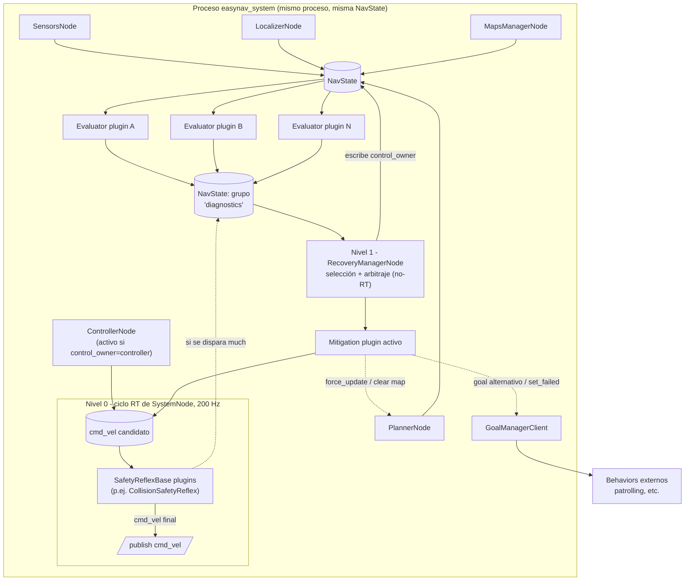

# Sistema de recuperación ante errores para EasyNav

## 0. Objetivo y fuentes

Este documento analiza dos aproximaciones ya existentes al problema de la recuperación ante
fallos en sistemas de navegación autónoma —los **Recovery Behaviors de Nav2** y el
**metacontrolador TOMASys/SysSelf** propuesto en la tesis doctoral de Esther Aguado González,
*"Systems that know what they are doing: A Model-Based Formal Specification for Robust
Autonomy"* (UPM, 2024)— y, a partir de lo aprendido de ambas, propone un diseño concreto
para EasyNav.

Fuentes analizadas:

- Código de Nav2 en `src/examples/navigation2` (paquetes `nav2_behaviors`, `nav2_behavior_tree`,
  `nav2_bt_navigator`, `nav2_controller`, `nav2_planner`, `nav2_core`) y `https://docs.nav2.org/rolling/`.
- `ESTHER_AGUADO_GONZALEZ.pdf`, en particular el Capítulo 7 (antecedente TOMASys), el
  Capítulo 8 (operacionalización del metacontrolador SysSelf) y el Capítulo 9 (casos de
  evaluación, especialmente el robot móvil Pioneer con Nav2 y los escenarios del TIAGo/TurtleBot2).
- El código actual de EasyNav en `src/EasyNavigation` (`easynav_core`, `easynav_system`,
  `easynav_controller`, `easynav_planner`, `easynav_localizer`, `easynav_sensors`,
  `easynav_maps_manager`, `easynav_interfaces`) y `src/easynav_behaviors`.

---

## 1. Análisis de Nav2: Recovery Behaviors

### 1.1 Arquitectura de plugins

Nav2 separa el problema en dos capas que cooperan:

- **`nav2_core::Behavior`** (`nav2_core/include/nav2_core/behavior.hpp:41-83`): interfaz abstracta
  con `configure()/cleanup()/activate()/deactivate()/getResourceInfo()`, calcada del patrón de
  lifecycle usado por planners y controllers. `getResourceInfo()` declara si el plugin necesita
  costmap local, global, ambos o ninguno, para que el servidor solo suscriba lo estrictamente
  necesario.
- **`TimedBehavior<ActionT>`** (`nav2_behaviors/include/nav2_behaviors/timed_behavior.hpp:67`):
  implementación de plantilla que monta un `nav2::SimpleActionServer<ActionT>` y resuelve toda
  la mecánica de acción (feedback, cancelación, timeouts). Un comportamiento concreto solo
  implementa `onRun()` (una vez) y `onCycleUpdate()` (cada ciclo mientras está `RUNNING`,
  devolviendo `SUCCEEDED/FAILED/RUNNING` + código de error).
- **`BehaviorServer`** (`nav2_behaviors/include/nav2_behaviors/behavior_server.hpp`): un único
  `LifecycleNode` que carga todos los comportamientos vía `pluginlib::ClassLoader<nav2_core::Behavior>`
  (`behavior_server.cpp:79-101`) y propaga `configure/activate/deactivate` 1:1 a cada plugin.
  Cada plugin se registra con `PLUGINLIB_EXPORT_CLASS` (p. ej. `plugins/spin.cpp:184`) contra el
  manifiesto `behavior_plugin.xml`.

### 1.2 Detección y disparo

La detección vive casi enteramente en el **árbol de comportamiento (BT)**, no dentro de los
servidores:

1. **Códigos de error estructurales.** `controller_server`/`planner_server` capturan excepciones
   internas (`NoValidControl`, `PatienceExceeded`, `FailedToMakeProgress`, `NoValidPath`, ...) y
   las traducen a un `error_code` numérico en el resultado de la acción
   (`nav2_controller/src/controller_server.cpp:543-615`).
2. **Nodos de condición sobre esos códigos**: `AreErrorCodesPresent`
   (`plugins/condition/are_error_codes_present_condition.hpp:38-72`) y sus especializaciones
   `WouldAControllerRecoveryHelp`, `WouldAPlannerRecoveryHelp`, etc., deciden si, para ese
   código concreto, tiene sentido intentar una recuperación (evita, por ejemplo, limpiar un
   costmap ante un `TF_ERROR`, que no lo arregla).
3. **Condiciones directas sobre estado/sensores**, independientes de las acciones:
   `IsStuckCondition` (deceleración anómala en `/odom`), `IsBatteryLowCondition`,
   `GoalUpdatedCondition` (aborta la recuperación si el usuario cambia el objetivo),
   `TransformAvailableCondition`.

El disparo estructural lo orquesta el nodo de control **`RecoveryNode`**
(`nav2_behavior_tree/.../recovery_node.cpp:31-119`): tiene exactamente dos hijos —subárbol
principal y subárbol de recuperación—; si el hijo 0 falla, ejecuta el hijo 1; si el hijo 1 tiene
éxito, reintenta el hijo 0, hasta `number_of_retries`.

### 1.3 Toma de control

Nav2 **no tiene un árbitro explícito de `cmd_vel`**: el control se transfiere como efecto
colateral de la semántica de cancelación de acciones ROS 2.

- Cuando el BT deja de tickear la acción `FollowPath` en curso (porque el `RecoveryNode` va a
  ejecutar el hijo de recuperación), `BtActionNode::halt()`
  (`nav2_behavior_tree/.../bt_action_node.hpp:325-352`) cancela el *goal* activo del
  `controller_server`, que deja de publicar en `cmd_vel`.
- Solo entonces el BT envía el *goal* de recuperación (p. ej. `Spin`); el `behavior_server`
  empieza a publicar en `cmd_vel` desde `TimedBehavior::execute()`.
- Al terminar, la recuperación publica `Twist` cero (`stopRobot()`,
  `timed_behavior.hpp:298-308`) y el `RecoveryNode` vuelve a tickear el hijo 0, que reenvía el
  *goal* de `FollowPath` y recupera el control.

Es decir: la exclusión mutua es un **efecto emergente** de que solo un servidor de acciones
tiene un *goal* activo cada vez — no hay mutex ni bus de arbitraje. `AssistedTeleop` es la
excepción: no toma control exclusivo, sino que filtra por seguridad un `cmd_vel` externo (control
supervisado, no autónomo).

### 1.4 Catálogo de comportamientos

| Comportamiento | Mecanismo |
|---|---|
| **Spin** | Gira in situ hasta `target_yaw`, con simulación de colisión hacia delante |
| **BackUp** / **DriveOnHeading** | Avance/retroceso en línea recta con límites de aceleración y chequeo de colisión |
| **Wait** | Sin actuación; simplemente espera un tiempo |
| **AssistedTeleop** | Filtra un `cmd_vel` de teleoperación humana con chequeo de colisión |
| **Clear\*CostmapService** (BT, no behavior_server) | Llama a servicios `nav2_msgs/srv/Clear*` de las capas de costmap |

### 1.5 Composición y escalado

El árbol por defecto (`navigate_to_pose_w_replanning_and_recovery.xml`) anida **tres niveles**:

1. `RecoveryNode` interno (retries=1) alrededor de `ComputePathToPose`/`FollowPath`: recuperación
   barata y local (limpiar el costmap correspondiente), condicionada por `WouldAXRecoveryHelp`.
2. Si eso falla, el `RecoveryNode` externo (retries=6) activa una rama de recuperación mayor.
3. Dentro, un **`RoundRobinNode`** (`round_robin_node.cpp:35-94`) va rotando entre
   limpiar-costmaps → `Spin` → `Wait` → `BackUp` en sucesivos reintentos, envuelto en un
   `ReactiveFallback` que revisa `GoalUpdated` en cada tick para abortar si el operador
   redirige el robot.

### 1.6 Uso de "blackboard"

El *blackboard* de BT.CPP es el estado compartido mínimo: el *handle* del nodo ROS, el buffer
TF, y sobre todo el contador `number_recoveries`
(`increment_recovery_count()`, `bt_action_node.hpp:459-465`), que se expone al cliente como
`feedback.number_of_recoveries` — la única señal de observabilidad "de fábrica" sobre cuánta
recuperación está ocurriendo.

### 1.7 Valoración

**Puntos fuertes**: arquitectura de plugins madura y bien probada en producción, generación de
comportamientos de movimiento reutilizables y seguros (con chequeo de colisión integrado),
composición declarativa y auditable en XML, coste computacional prácticamente nulo (ticks de
BT + condiciones directas sobre datos ya disponibles).

**Puntos débiles** (algunos señalados explícitamente por la propia Esther Aguado en el
apartado 9.3.1 de su tesis, comparando su enfoque con Nav2): las asociaciones
fallo→recuperación están **codificadas a mano en el XML** para cada aplicación; no hay
**trazabilidad** de por qué se disparó una recuperación concreta (la razón vive solo en la
cabeza del ingeniero que escribió el árbol); y una recuperación "de brocha gorda" puede tener
**efectos colaterales**: por ejemplo, limpiar el costmap global por un fallo del *planner* puede
afectar al costmap local usado por un *controller* que funcionaba correctamente.

---

## 2. Análisis de la propuesta de Esther Aguado (TOMASys / SysSelf)

### 2.1 Marco conceptual: el metacontrolador y el bucle MAPE-K

La tesis parte de TOMASys (*Teleological and Ontological Model for Autonomous Systems*) y lo
evoluciona a **SysSelf**. La idea central es el **metacontrolador**: mientras un controlador
convencional cierra un lazo sobre una variable física (p. ej. velocidad), el metacontrolador
cierra un lazo **sobre la funcionalidad del sistema**, disparando una reconfiguración cuando el
sistema se desvía de lo esperado.

La ejecución sigue el patrón **MAPE-K** (Monitor–Analyze–Plan–Execute sobre una Knowledge
Base compartida):

- **Monitor**: un *observer* detecta fallos de componente o métricas de calidad (QA) por debajo
  de lo requerido.
- **Analyze**: un razonador (ontológico, con reglas SWRL en TOMASys; con Teoría de Categorías
  en SysSelf, para reducir el coste de razonamiento) propaga el fallo desde el *Componente*
  hasta la *Function Grounding* y de ahí al *Objective*, y marca qué *Function Designs*
  alternativos siguen siendo realizables.
- **Plan**: se elige el mejor *Function Design* disponible que cumpla los requisitos de QA
  (seguridad, energía, rendimiento).
- **Execute**: se ejecuta la reconfiguración (cambiar de componente, remapear tópicos, ajustar
  parámetros o, en última instancia, cambiar el objetivo de la misión).

### 2.2 Modelo de conceptos

| Concepto | Significado |
|---|---|
| **Function** / **Objective** | Qué debe lograr el sistema (p. ej. "navegar") |
| **Function Design** | Una alternativa concreta de diseño para lograr la función (p. ej. "localizar con láser" vs. "localizar con cámara RGB-D") |
| **Function Grounding** | La instancia en ejecución de un Function Design en un momento dado |
| **Component** | Módulo estructural real (sensor, actuador, nodo software) |
| **Quality Attribute (QA)** | Métrica (seguridad, energía, rendimiento) estimada por diseño y medida en tiempo de ejecución |

### 2.3 Implementación de referencia en ROS 2

La parte más directamente aplicable a EasyNav es la implementación práctica (Capítulo 8):

- **Dos nodos ROS 2**: un nodo *observer* que monitoriza continuamente componentes,
  capacidades, objetivos y valores, y publica un **mensaje de diagnóstico** cuando algo falla o
  degrada por debajo del umbral esperado (con: entidad afectada, información adicional,
  severidad — error/warning); y un nodo **metacontrolador** que espera ese mensaje, razona sobre
  el modelo y ejecuta la reconfiguración.
- La reconfiguración se materializa como **ficheros YAML** con la solución elegida (qué nodo
  lanzar, qué parámetros usar, qué remapeos aplicar).
- Requisitos explícitos que el propio trabajo exige a cualquier sistema que quiera adoptar este
  enfoque: **redundancia** (tiene que existir una alternativa real a la que conmutar),
  **monitorización** (los componentes deben reportar su estado en tiempo real) y
  **reconfigurabilidad** (el sistema debe permitir sustituir/lanzar/parametrizar en caliente).

### 2.4 Casos de estudio relevantes

- **UX-1 (robot submarino minero)**: fallo de un propulsor → el metacontrolador selecciona el
  *Function Design* de propulsión que no depende del propulsor averiado.
- **TIAGo/TurtleBot2, contingencia de láser (MROS)**: al fallar el LiDAR, el metacontrolador
  detecta que una cámara RGB-D puede cubrir la misma función (localización/detección de
  obstáculos) con peor QA, y reconfigura remapeando `pointcloud_to_laserscan` hacia el tópico de
  *scan* que consume el resto del *stack* de Nav2, **reduciendo además el límite de velocidad**
  porque la nueva fuente es más lenta/ruidosa.
- **Robot móvil Pioneer + Nav2, Escenario 4 (fallo de sensor crítico)**: reproduce el caso
  anterior sobre Nav2 real, sustituyendo `/urg_node` (láser) por `/pointcloud_to_laserscan`
  (cámara) sin detener la misión.
- **Escenario 5 (error de capacidad no resoluble)**: un fallo de comunicación con el operador no
  tiene alternativa dentro del sistema; el metacontrolador **no reconfigura un componente, sino
  que cambia el objetivo de la misión**, mandando al robot a un `safe_wp` (waypoint seguro) a
  esperar mantenimiento. Esto es clave: la mitigación no siempre es "sustituir una pieza", a
  veces es "relajar/cambiar la misión".

### 2.5 Crítica explícita a Nav2 (apartado 9.3.1 de la tesis)

La propia autora contrasta su enfoque con el de Nav2 y señala justo las debilidades descritas en
§1.7: las reglas fallo→recuperación de Nav2 son "ad-hoc", el razonamiento del ingeniero no queda
representado en ningún sitio (falta de transparencia/trazabilidad), y una recuperación puede
"contaminar" un subsistema sano (su ejemplo: limpiar el costmap global por un fallo del planner
puede afectar al costmap local de un controller que funcionaba bien).

### 2.6 Valoración

**Puntos fuertes**: separación explícita y disciplinada entre *detectar* (Monitor+Analyze) y
*actuar* (Plan+Execute); trazabilidad y justificación explícita de cada decisión; generalidad
(el mismo motor de metacontrol sirve para un submarino o un robot de interiores); capacidad de
escalar la mitigación **más allá del componente** hasta el nivel de misión (cambiar el
objetivo, no solo el actuador).

**Puntos débiles / coste**: requiere modelar explícitamente el sistema en una ontología OWL
(esfuerzo de ingeniería no trivial, curva de aprendizaje pronunciada — limitación que la propia
tesis reconoce en sus conclusiones); el razonamiento DL/SWRL de TOMASys resultó
**computacionalmente caro** (creciendo exponencialmente con el tamaño de la base de
conocimiento, ~700 ms para un modelo de 26 individuos ≈ 1.4 Hz), lo que motivó migrar a Teoría
de Categorías en SysSelf; incluso con esa mejora, los tiempos de recuperación medidos son de
**~1-5 s** (frente a los pocos milisegundos de un *tick* de BT); depende de un motor de
razonamiento externo (Pellet/Owlready2) fuera del ecosistema habitual de ROS 2.

---

## 3. Comparativa

| Dimensión | Nav2 | TOMASys / SysSelf |
|---|---|---|
| Dónde vive la detección | Árbol de comportamiento (condiciones + códigos de error) | Nodo *observer* + razonador sobre modelo |
| Cómo se decide la mitigación | Codificado a mano en el XML (round-robin fijo) | Seleccionado dinámicamente por razonamiento sobre QAs/realizabilidad |
| Toma de control | Efecto colateral de cancelar/lanzar acciones | Reconfiguración explícita (lanzar/parar nodos, remapear) |
| Alcance de la mitigación | Movimiento del robot / limpiar mapas | Componente, capacidad **o la propia misión** |
| Trazabilidad | Ninguna explícita (razón solo en la cabeza del diseñador) | Explícita (modelo consultable) |
| Coste computacional | Prácticamente nulo | Notable (cientos de ms a segundos) |
| Esfuerzo de autoría | Editar XML + escribir un plugin C++ | Modelar ontología OWL + observers |
| Extensibilidad | Alta (pluginlib + nuevas condiciones) | Alta en teoría, cara en la práctica (modelo formal) |

**Conclusión de la comparativa**: Nav2 acierta en la *mecánica de ingeniería* (plugins
ligeros, lifecycle, catálogo reutilizable de comportamientos, coste ínfimo) pero se queda corto
en la *arquitectura de decisión* (todo hardcodeado, sin trazabilidad, alcance limitado al
movimiento/mapas). SysSelf acierta en la *arquitectura de decisión* (separación
evaluación/mitigación, trazabilidad, alcance hasta el nivel de misión) pero paga un coste de
ingeniería y de rendimiento que no encaja con un bucle de control a 200 Hz como el de EasyNav.

La propuesta para EasyNav toma la mecánica de Nav2 (plugins, lifecycle, catálogo de
comportamientos) y la disciplina arquitectónica de SysSelf (evaluación desacoplada de
mitigación, diagnóstico explícito, escalado hasta nivel de misión), **sin** adoptar el
razonamiento OWL/DL como pieza obligatoria — se deja como una vía de extensión opcional.

---

## 4. Restricciones y oportunidades encontradas en el código actual de EasyNav

Antes de proponer nada, conviene fijar lo que EasyNav ya tiene y lo que le falta:

- **`NavState`** (`easynav_common/include/easynav_common/types/NavState.hpp:82`) es la
  *blackboard* real: un mapa clave→valor con tipo, protegido por `std::mutex`, compartido por
  `shared_ptr` entre `SystemNode` y todos sus subsistemas. Ya soporta **grupos**
  (`set_group()`/`get_group()`, `NavState.hpp:169`), usados hoy por `SensorsNode` para agregar
  percepciones de varios sensores — mecanismo directamente reutilizable para agregar
  diagnósticos de varios evaluadores.
- **`SystemNode`** (`easynav_system/include/easynav_system/SystemNode.hpp:52`) es un
  `LifecycleNode` que posee `SensorsNode`, `LocalizerNode`, `MapsManagerNode`, `PlannerNode` y
  `ControllerNode`, todos también `LifecycleNode`, y los orquesta en dos bucles manuales
  (`system_main.cpp`): uno RT a `rt_freq` (ciclo `sensors→localizer→controller→publicar
  cmd_vel`) y uno no-RT a `freq` (ciclo `sensors→localizer→maps_manager→goal_manager→planner`).
  Esto encaja literalmente con el requisito de diseño ya anotado en `docs/design.md`: *"Well
  synchronized, with real time and non-real time parts. All in one process"* — la evaluación de
  diagnósticos **debe** vivir en este mismo proceso, no en un nodo aparte.
- **`MethodBase`** (`easynav_core/include/easynav_core/MethodBase.hpp:35`) ya da a cada plugin
  control de frecuencia (`isTime2Run(RT)`, `setRun(RT)`) y ya **detecta y avisa** cuando un
  plugin se pasa de su presupuesto de ciclo (`RCLCPP_WARN_THROTTLE`,
  `MethodBase.cpp:66-73,84-91`) — el embrión de un evaluador de "plugin lento".
- **`ControllerMethodBase::is_inminent_collision()/on_inminent_collision()`**
  (`ControllerMethodBase.cpp:65-186`) es, hoy, el **único** mecanismo real de "override" de
  `cmd_vel` que existe en EasyNav — precedente arquitectónico directo tanto para el reflejo de
  seguridad de nivel 0 (§5.2) como para el mecanismo de arbitraje de control de nivel 1 que se
  propone en §5.7.
- **`PlannerMethodBase::force_update()`** ya existe para forzar un replanificado inmediato
  (usado cuando cambian los objetivos) — reutilizable como acción de mitigación "recalcula ya".
- **`GoalManager`** ya tiene `set_failed()/set_error()/set_preempted()`
  (`easynav_system/include/easynav_system/GoalManager.hpp:96-107`) y el protocolo
  `NavigationControl` ya define los tipos `FAILED/ERROR/CANCELLED` — pero, según el análisis del
  código, **estas llamadas solo se usan en tests**, nunca desde una ruta de fallo real. Es un
  cable ya tendido pero no conectado: la propuesta lo aprovecha en vez de inventar un protocolo
  nuevo.
- **Huecos reales**: no existe ningún concepto de diagnóstico/estado de salud
  (`diagnostic_msgs`, "watchdog", "heartbeat" → cero resultados); `NavState::get/get_safe` lanza
  `std::runtime_error` sin capturar en ningún punto del ciclo (un plugin que lanza excepción
  tumba el proceso); no hay detección de estancamiento/timeout pese a que el propio comentario
  de `GoalManager::update()` dice que debería haberla; las "behaviors" actuales
  (`easynav_patrolling_behavior[_py]`) son nodos externos que solo hacen *polling* del estado del
  `GoalManagerClient` y no tienen ninguna lógica de reintento/recuperación.
- **Convención de plugins**: pluginlib + `PLUGINLIB_EXPORT_CLASS`, un fichero
  `<paquete>_plugins.xml` por paquete, selección por parámetros `<tipo>_types` +
  `<instancia>.plugin`, todo contra la interfaz base declarada en `easynav_core`. Cualquier
  propuesta nueva debe encajar en este mismo patrón para no introducir un mecanismo de
  extensión paralelo.

---

## 5. Propuesta de diseño para EasyNav

### 5.1 Principios rectores

1. **Evaluación dentro del proceso.** El diagnóstico de fallos necesita leer `NavState` con
   coste mínimo y sin latencia de IPC; por tanto vive en el mismo proceso que `SystemNode`,
   igual que el resto de subsistemas.
2. **Evaluación y mitigación son responsabilidades distintas y desacopladas**, como en
   SysSelf: un evaluador nunca actúa sobre el robot; un mitigador nunca decide *cuándo* debe
   ejecutarse por sí solo, salvo el criterio de aplicabilidad que él mismo declara.
3. **La urgencia manda sobre la elegancia.** No todo fallo puede esperar a un razonamiento
   deliberativo; lo que exige reacción en el mismo ciclo de control (una colisión inminente a
   alta velocidad) se resuelve con un reflejo síncrono en tiempo real, no con el mismo
   mecanismo que decide, por ejemplo, cambiar de objetivo de misión.
4. **Todo es plugin**, siguiendo el patrón ya usado por controller/planner/localizer: nuevas
   estrategias de detección, reflejo o mitigación se añaden sin tocar el núcleo, vía pluginlib.
5. **Afinidad de autoría.** Quien mejor conoce los modos de fallo de un componente es quien lo
   ha escrito; el diseño debe permitir (y fomentar) que esos plugins de recuperación
   especializados vivan junto al componente al que pertenecen, no forzados a un paquete
   genérico y desconectado.
6. **Reutilizar lo que EasyNav ya tiene** (grupos de `NavState`, `MethodBase`,
   `force_update()`, `GoalManagerClient`, el precedente de `on_inminent_collision`) en vez de
   inventar un protocolo de coordinación paralelo.
7. **Barato por defecto, potente si hace falta.** El motor de decisión por defecto es una tabla
   de prioridades configurable por parámetros (barato, como Nav2); se deja un punto de
   extensión (`score()`) para quien quiera implementar una selección más sofisticada
   (inspirada en las QAs de SysSelf), sin obligar a nadie a cargar con un razonador OWL.

### 5.2 Dos niveles: reflejos de seguridad (RT) y recuperación deliberativa (no-RT)

Un punto crítico de diseño: **no todo lo que llamamos "recuperación" tolera la latencia de un
ciclo no-RT**. El caso paradigmático es el chequeo de colisión inminente que hoy vive dentro de
`ControllerMethodBase` (`is_inminent_collision()/on_inminent_collision()`,
`ControllerMethodBase.cpp:65-186`): a alta velocidad, retrasar esa reacción hasta el siguiente
ciclo del `RecoveryManagerNode` no-RT sería inaceptable. Por eso el sistema se divide en dos
niveles con requisitos y ubicación distintos:

| | **Nivel 0 — Reflejos de seguridad** | **Nivel 1 — Recuperación deliberativa** |
|---|---|---|
| Frecuencia | Ciclo RT (200 Hz, el mismo que `cmd_vel`) | Ciclo no-RT |
| Lógica | Chequeo síncrono, barato, sin *reasoning* | Diagnóstico + selección + arbitraje (MAPE-K ligero) |
| Dónde vive | `SystemNode`, en el punto único donde ya se publica `cmd_vel` | `RecoveryManagerNode` |
| Interfaz nueva | `SafetyReflexBase` | `RecoveryEvaluatorBase` / `RecoveryMitigationBase` |
| Ejemplo | Colisión inminente → poner `cmd_vel` a cero | Sensor caído N segundos → cambiar de fuente de localización |
| Puede vetar/anular `cmd_vel` | Sí, siempre, sea quien sea quien lo haya escrito | No directamente; actúa a través de `control_owner` (§5.7) |

**Por qué el reflejo debe vivir en `SystemNode` y no en `ControllerNode`.** Con el diseño de
arbitraje de control de §5.7, el `cmd_vel` publicado cada ciclo puede proceder del `controller`
nominal **o** de una mitigación de movimiento activa (p. ej. `SpinRecovery`). Si el chequeo de
colisión siguiera atado únicamente a `ControllerMethodBase`, dejaría de aplicarse justo cuando
una recuperación tiene el control — el peor momento para perder esa protección. Por eso se
propone que `SystemNode` cargue los plugins `SafetyReflexBase` (nuevo `pluginlib::ClassLoader`
análogo al que ya usan `ControllerNode`/`PlannerNode`, parametrizado con `safety_reflex_types`)
y los ejecute en `system_cycle_rt()` **justo antes** del punto donde hoy ya se publica
`cmd_vel` (`SystemNode.cpp:222-234`), sea cual sea el origen de ese valor. El chequeo de
colisión actual pasa a ser, sin cambiar su ubicación real en el hilo RT ni su coste, el primer
plugin `SafetyReflexBase` de referencia: `CollisionSafetyReflex`.

```cpp
// easynav_core/include/easynav_core/SafetyReflexBase.hpp
class SafetyReflexBase : public MethodBase
{
public:
  // Se invoca en el ciclo RT, justo antes de publicar cmd_vel. Debe ser barato
  // y determinista: nada de I/O, nada de reasoning, nada que pueda bloquear.
  virtual bool check(NavState & nav_state) = 0;      // ¿hay que intervenir ya?
  virtual void mitigate(NavState & nav_state) = 0;    // interviene sobre cmd_vel in-place
};
```

Cuando un reflejo se dispara, además de actuar de inmediato sobre `cmd_vel`, escribe (con la
misma primitiva barata `set_group()` que ya usan los evaluadores) una entrada en el grupo
`"diagnostics"` de `NavState`. Así, el nivel 1 puede darse cuenta si un reflejo se está
disparando de forma repetida — por ejemplo, un evaluador `RepeatedReflexEvaluator` que cuenta
activaciones de `CollisionSafetyReflex` en una ventana de tiempo y, si son demasiadas, escala a
una mitigación deliberativa (forzar replanificado, limpiar mapa, o incluso ir a un waypoint
seguro) — sin que la reacción inmediata dependa nunca de ese ciclo lento. Es exactamente el
mismo patrón que separa un reflejo medular de una decisión cortical: reacciona primero,
razona después.

**La transición de nivel 0 a nivel 1 no se sincroniza con un mecanismo entre hilos, se
codifica como una condición sobre los datos.** El ciclo RT y el ciclo no-RT corren en paralelo,
en hilos distintos (`system_main.cpp`), así que un evaluador podría leer `NavState` en mitad de
una frenada. Si un evaluador actuara con solo "el reflejo está activo + hay un obstáculo
cerca", podría disparar una mitigación deliberativa (p. ej. alejarse) **antes** de que el robot
haya terminado de frenar, sustituyendo un perfil de frenada seguro por un comando de movimiento
a destiempo. Por eso, cualquier evaluador que escale a partir de un `SafetyReflexBase` debe
exigir una condición compuesta, verificable directamente en `NavState` sin locks ni eventos
adicionales:

1. El reflejo sigue considerando la situación insegura (`check()` seguiría siendo `true`).
2. La velocidad medida del robot está por debajo de un umbral, sostenida durante una pequeña
   ventana de *debounce* (p. ej. 150-300 ms, para filtrar ruido) — dato que no hay que inventar:
   `robot_pose` ya es un `nav_msgs::msg::Odometry` con su campo `twist`.

Solo cuando ambas se cumplen es seguro publicar un diagnóstico *accionable*; mientras tanto, el
evaluador puede publicar como mucho un estado informativo al que **no hay ningún mitigador
asociado** en la tabla de prioridades — una segunda barrera, independiente de la primera, por si
la condición de *debounce* fallara.

### 5.3 Dónde vive cada pieza: `easynav_core`, `easynav_recovery`, `easynav_plugins`

Siguiendo la convención que EasyNav ya usa hoy (interfaces en `easynav_core`, nodo propio por
subsistema en `src/EasyNavigation`, plugin de referencia mínimo junto al nodo, plugins
completos en `src/easynav_plugins`):

| Elemento | Paquete | Precedente que sigue |
|---|---|---|
| `SafetyReflexBase`, `RecoveryEvaluatorBase`, `RecoveryMitigationBase` (interfaces) | `easynav_core` | `ControllerMethodBase`, `PlannerMethodBase`, etc. viven ahí |
| `RecoveryManagerNode` (nodo, carga de plugins, arbitraje) | nuevo paquete `easynav_recovery` en `src/EasyNavigation` | `easynav_controller`, `easynav_planner`, ... |
| `CollisionSafetyReflex`, `StopAndWaitMitigation` (plugins de referencia, "siempre seguros", sin dependencias externas) | dentro de `easynav_recovery` (o `easynav_controller`, para `CollisionSafetyReflex`, ya que hoy vive ahí) | `DummyController` dentro de `easynav_controller` |
| `SpinRecovery`, `BackUpRecovery`, `ClearMapRecovery`, `SafeWaypointRecovery`, ... (catálogo general) | `src/easynav_plugins/recovery_mitigations/...` | `easynav_simple_controller`, `easynav_vff_controller`, ... |
| Evaluadores genéricos (`NoPathEvaluator`, `ControllerStuckEvaluator`, `GoalStallEvaluator`, ...) | `src/easynav_plugins/recovery_evaluators/...` | ídem |
| Evaluadores/mitigadores **especializados en un componente concreto** (ver §5.9) | **junto al propio plugin de ese componente** (p. ej. dentro de `easynav_amcl_localizer`) | — (recomendación nueva, ver más abajo) |

Como con el resto de categorías, se registran contra `base_class_type="easynav::<Nombre>Base"`
del paquete `easynav_core`, y se añaden entradas `recovery_evaluator`/`recovery_mitigation`/
`safety_reflex` al diccionario `BASE_CLASSES` de `easynav_tools/easynav_tools/cli/plugins.py`.

### 5.4 Nuevo subsistema: `easynav_recovery`

Se propone un sexto subsistema, `RecoveryManagerNode`, que `SystemNode` posee y gestiona
exactamente igual que a los demás (`on_configure/on_activate/on_deactivate` propagados,
`easynav_system/src/easynav_system/SystemNode.cpp:111-175`), y que se ejecuta **solo en el
ciclo no-RT** (`system_cycle()`): evaluación, selección y arbitraje deliberativos, sin
necesidad de correr a 200 Hz. (El nivel RT descrito en §5.2 vive directamente en `SystemNode`,
no en `RecoveryManagerNode`.)

Cuando `RecoveryManagerNode` activa una mitigación de movimiento, esta sí necesita producir
`cmd_vel` a frecuencia de control: para eso, la propia mitigación se ejecuta desde un hook
`cycle_rt()` que `SystemNode` invoca junto al de `ControllerNode` (§5.7) — es un cambio pequeño
y acotado sobre `system_main.cpp`/`SystemNode`, no una reestructuración del bucle.

Se elige deliberadamente el nombre `RecoveryManagerNode` (y no `RecoveryNode`) para no
colisionar conceptualmente con el nodo de control `RecoveryNode` de BT.CPP en Nav2, que es una
cosa distinta.

**Vista general del flujo** (nivel 0 en RT dentro de `SystemNode`, nivel 1 en no-RT dentro de
`RecoveryManagerNode`):



### 5.5 Evaluación: `RecoveryEvaluatorBase`

```cpp
// easynav_core/include/easynav_core/RecoveryEvaluatorBase.hpp
class RecoveryEvaluatorBase : public MethodBase
{
public:
  // Lee NavState, nunca escribe cmd_vel/path/etc. Si detecta un problema,
  // escribe su propio diagnóstico en el grupo "diagnostics" de NavState.
  virtual void update(NavState & nav_state) = 0;
};
```

Cada evaluador escribe (si procede) un `diagnostic_msgs::msg::DiagnosticStatus` — reutilizando
un tipo **estándar** de ROS 2 en vez de inventar uno nuevo en `easynav_interfaces`, para poder
aprovechar herramientas ya existentes (`rqt_robot_monitor`, etc.) — dentro del grupo
`"diagnostics"` de `NavState`, con la misma primitiva `set_group()` que ya usa `SensorsNode`:

```cpp
nav_state.set_group<diagnostic_msgs::msg::DiagnosticStatus>(
  "diagnostics", get_plugin_name(), status);
```

Catálogo inicial de evaluadores (cada uno, un plugin independiente, cargable/descargable por
parámetro `evaluator_types`):

| Evaluador | Qué observa | Precedente |
|---|---|---|
| `CycleOverrunEvaluator` | Un plugin excede su presupuesto de ciclo | Formaliza el aviso ya existente en `MethodBase::isTime2Run[RT]` |
| `BlackboardFaultEvaluator` | Excepciones de tipo/clave de `NavState` capturadas en el punto de invocación de cada plugin, en vez de tumbar el proceso | Cierra el hueco de `NavState::get/get_safe` lanzando sin capturar |
| `NoPathEvaluator` | El planner no produce `path`, o el `path` queda vacío | Análogo a `NO_VALID_PATH` de Nav2 |
| `ControllerStuckEvaluator` | `cmd_vel` != 0 pero el robot no avanza (comparando `robot_pose` en ventanas de tiempo) | Análogo a `IsStuckCondition` de Nav2 |
| `GoalStallEvaluator` | Un objetivo activo lleva N segundos sin progreso | Rellena el timeout que `GoalManager::update()` dice tener pero no implementa |
| `SensorDropoutEvaluator` | Una fuente de percepción deja de actualizarse | Análogo al caso "láser no disponible" de SysSelf |
| `RepeatedReflexEvaluator` | Cuenta activaciones de un `SafetyReflexBase` (p. ej. `CollisionSafetyReflex`) en una ventana de tiempo | Cierra el lazo entre el nivel 0 (RT) y el nivel 1 (§5.2): un reflejo que se dispara mucho es, en sí mismo, un síntoma a nivel deliberativo |
| `ObstacleTooCloseEvaluator` | Mientras `CollisionSafetyReflex` sigue activo **y** la velocidad medida (`robot_pose.twist`) lleva un *debounce* por debajo de un umbral, comprueba si la distancia al obstáculo sigue por debajo de un umbral *de seguridad para operar* (más exigente que el que hace saltar el reflejo) | Es el "darse cuenta, ya en no-RT, de que hay que recuperarse" del §5.13 — la condición compuesta de §5.2 evita disparar mientras el robot todavía está frenando |
| `RecurringPatternEvaluator` | No mira el instante actual, sino el histórico de diagnósticos/mitigaciones que `RecoveryManagerNode` ya lleva para sus contadores de reintento (§5.6): si un mismo código reaparece más de N veces en una ventana de tiempo, emite un diagnóstico distinto y de nivel superior, `"recurring_pattern"` | Detección de mala configuración, ver §5.14 |

### 5.6 Selección y arbitraje: `RecoveryManagerNode`

Cada ciclo no-RT, `RecoveryManagerNode`:

1. Lee el grupo `"diagnostics"` de `NavState`.
2. Si ya hay una mitigación **que ocupa `control_owner`** activa, le da prioridad a comprobar si
   ha terminado (`on_cycle()` devuelve `SUCCEEDED/FAILED`) antes de considerar diagnósticos
   nuevos de ese mismo tipo — un único mitigador de movimiento activo a la vez, igual que
   EasyNav ya impone un único controller/planner activo a la vez. Los mitigadores que **no**
   necesitan `control_owner` (limpiar mapa, forzar replanificado, ajustar un parámetro, §5.14)
   no compiten por ese recurso y pueden ejecutarse aunque ya haya un mitigador de movimiento en
   marcha — por eso `RecoveryMitigationBase` declara explícitamente
   `virtual bool requires_control() const {return false;}`, que solo sobrescriben a `true` los
   mitigadores de movimiento.
3. Si no hay mitigación activa (o hay hueco porque el nuevo diagnóstico no compite por
   `control_owner`), escoge el diagnóstico de mayor severidad y busca, entre los
   plugins `RecoveryMitigationBase` cargados, cuáles declaran poder atenderlo
   (`can_handle(diagnostic)`); por defecto se ordenan por una tabla de prioridad configurable
   por parámetros (`recovery.mapping.<código>: [plugin_a, plugin_b, ...]`, inspirado en el
   `RoundRobinNode` de Nav2 pero **indexado por tipo de diagnóstico**, no una única cadena
   global — así se evita el problema que la tesis señala de Nav2: aplicar una recuperación
   genérica que golpea un subsistema sano).
4. Mantiene, por par (código de diagnóstico, plugin de mitigación), un contador de reintentos y
   un *cooldown*, con reseteo cuando el diagnóstico lleva un tiempo sin reaparecer — mismo
   patrón que `RecoveryNode::retry_count_`/`RoundRobinNode::current_child_idx_` en Nav2.
5. Si se agotan los reintentos de todos los mitigadores aplicables, escala a una
   **mitigación de último recurso a nivel de misión** (§5.8).

`RecoveryMitigationBase` (nueva jerarquía, también en `easynav_core`, junto a
`RecoveryEvaluatorBase` y `SafetyReflexBase`):

```cpp
class RecoveryMitigationBase : public MethodBase
{
public:
  virtual bool can_handle(const diagnostic_msgs::msg::DiagnosticStatus & d) const = 0;
  virtual void on_start(NavState & nav_state) {}
  virtual RecoveryStatus on_cycle(NavState & nav_state) = 0;  // RUNNING | SUCCEEDED | FAILED
  virtual void on_stop(NavState & nav_state) {}
  // true solo en mitigadores de movimiento: indica que necesita ocupar control_owner (§5.7)
  // y por tanto compite en exclusiva con otros mitigadores del mismo tipo.
  virtual bool requires_control() const {return false;}
  // Punto de extensión opcional para selección más fina (inspirado en las QAs de SysSelf);
  // por defecto usa la prioridad declarada por parámetros.
  virtual float score(const diagnostic_msgs::msg::DiagnosticStatus &) const {return priority_;}
};
```

### 5.7 Cómo toma el control un comportamiento de recuperación

Esta es la pregunta explícita planteada, y donde EasyNav ya tiene un precedente directo
(`on_inminent_collision`) que conviene generalizar en vez de sustituir:

1. Se añade a `NavState` una clave `"control_owner"` (string), escrita **solo** por
   `RecoveryManagerNode`. Valor por defecto/ausente: `"controller"`.
2. Cuando `RecoveryManagerNode` activa una mitigación que necesita mover el robot (p. ej.
   `SpinRecovery`), llama a `on_start()` del plugin y escribe
   `nav_state.set("control_owner", "recovery:spin")`.
3. En `SystemNode::system_cycle_rt()` (cambio acotado sobre el código actual), antes de decidir
   qué escribe en `cmd_vel` cada ciclo:
   - Si `control_owner == "controller"`: se ejecuta `controller_node_->cycle_rt(...)` como hoy.
   - Si no: se ejecuta `recovery_node_->cycle_rt(nav_state_, trigger)`, que internamente llama
     a `on_cycle()` del mitigador activo, y es ese resultado el que queda en la clave
     `"cmd_vel"` que el propio `SystemNode` ya publica al final del ciclo
     (`SystemNode.cpp:222-234`) — **no se duplica el punto de publicación**, solo se decide
     quién escribe esa clave ese ciclo.
4. Cuando `on_cycle()` devuelve `SUCCEEDED` o `FAILED`, `RecoveryManagerNode` llama a
   `on_stop()` y restaura `control_owner = "controller"` — el controlador nominal recupera el
   control en el siguiente ciclo, igual que en Nav2 el `RecoveryNode` vuelve a tickear el hijo 0
   tras el éxito de la rama de recuperación.
5. **Regla de diseño obligatoria para los evaluadores**: todo evaluador que observe `cmd_vel` o
   el comportamiento del controlador (p. ej. `ControllerStuckEvaluator`) debe comprobar primero
   `control_owner`, y no evaluar mientras no valga `"controller"` — evita que la propia
   recuperación se autodiagnostique como un fallo nuevo (el mismo papel que cumple
   `GoalUpdatedCondition`/las condiciones `WouldAXRecoveryHelp` en Nav2, que existen
   precisamente para no disparar recuperaciones sobre síntomas que la propia recuperación
   produce).

Para mitigaciones que **no** requieren `cmd_vel` (p. ej. limpiar una capa del mapa, forzar un
replanificado, o cambiar de objetivo), no hace falta tocar `control_owner` en absoluto: basta con
que el plugin llame directamente a las operaciones ya existentes (`force_update()` del planner,
una operación de reseteo del `MapsManagerBase`, o `GoalManagerClient`).

Se valoró la alternativa de implementar las mitigaciones de movimiento como
`ControllerMethodBase` intercambiados en caliente por `ControllerNode` (reutilizando toda su
infraestructura RT y el chequeo de colisión). Se descarta como mecanismo *por defecto* porque
pluginlib exige un único `base_class_type` por plugin y porque `ControllerNode` hoy solo carga
su plugin en `on_configure()` (no hay una ruta de intercambio en caliente); se deja anotado como
posible optimización futura si el número de mitigadores de movimiento crece mucho.

### 5.8 Escalado a nivel de misión

Inspirado directamente en el Escenario 5 de la tesis (fallo de comunicación → ir a un waypoint
seguro): cuando ningún `RecoveryMitigationBase` puede atender un diagnóstico, o se agotan los
reintentos, `RecoveryManagerNode` ejecuta una mitigación de "último recurso" que:

- Usa `GoalManagerClient` (el mismo cliente que ya usa `PatrollingNode`) para cancelar el
  objetivo actual y, si está configurado, enviar un objetivo alternativo (p. ej. un
  `safe_waypoint` predefinido).
- Si no hay alternativa configurada, llama a `GoalManager::set_failed(reason)` /
  `set_error(reason)` — **conectando por fin una ruta real** a un mecanismo que hoy solo
  disparan los tests — de forma que cualquier *behavior* externo (como `PatrollingNode`, que ya
  sabe interpretar `NAVIGATION_FAILED`/`ERROR` vía `GoalManagerClient::State`) reaccione de
  forma consistente, sin necesitar saber nada sobre el sistema de recuperación.

### 5.9 Extensibilidad y convenciones

Todo nuevo evaluador, mitigador o reflejo **genérico** (que no dependa de conocimiento interno
de un componente concreto) se añade exactamente como cualquier otro plugin de EasyNav hoy:

- Paquete `easynav_plugins/recovery_evaluators/easynav_<nombre>_evaluator`,
  `easynav_plugins/recovery_mitigations/easynav_<nombre>_mitigation` o
  `easynav_plugins/safety_reflexes/easynav_<nombre>_reflex`.
- `PLUGINLIB_EXPORT_CLASS(easynav::<Nombre>, easynav::RecoveryEvaluatorBase)` (o
  `RecoveryMitigationBase`/`SafetyReflexBase`), manifiesto `<paquete>_plugins.xml`, exportado en
  `CMakeLists.txt` con `pluginlib_export_plugin_description_file(easynav_core ...)`.
- Selección por parámetros `evaluator_types`/`mitigation_types`/`safety_reflex_types` +
  `<instancia>.plugin`, igual que `controller_types`/`planner_types`.
- Se añade una entrada `recovery_evaluator`/`recovery_mitigation`/`safety_reflex` al diccionario
  `BASE_CLASSES` de `easynav_tools/easynav_tools/cli/plugins.py`, para que la CLI existente
  los liste igual que al resto de categorías.

**Recuperación especializada, co-localizada con el componente que la origina.** Además del
catálogo genérico anterior, el diseño anima explícitamente a que el autor de un plugin de
`localizer`/`planner`/`controller`/`sensor` publique, **en su propio paquete**, evaluadores y
mitigadores especializados en los modos de fallo que solo él conoce bien — exactamente la idea
de fondo de TOMASys/SysSelf: quien diseña la pieza es quien mejor sabe diagnosticarla y
repararla. No hace falta ningún mecanismo nuevo para esto: un manifiesto pluginlib ya admite
varias `<class>` de distinto `base_class_type` en el mismo fichero, así que basta con añadir
las clases nuevas al `<paquete>_plugins.xml` que ese plugin ya tiene. Ejemplo concreto:

- El autor de `easynav_plugins/localizers/easynav_amcl_localizer` (hipotético `AMCLLocalizer`)
  conoce, por ejemplo, que la dispersión de partículas o la traza de la covarianza son buenos
  indicadores de pérdida de convergencia — algo que un evaluador genérico no puede saber. Ese
  mismo autor añade, en el mismo paquete:
  - Un `AmclConvergenceEvaluator : RecoveryEvaluatorBase` que lee esos datos (que el propio
    `AMCLLocalizer` ya debería escribir en `NavState`, p. ej. bajo
    `"localizer.amcl.covariance_trace"`, junto a `"robot_pose"`) y, si se degradan, publica un
    `diagnostic_msgs::msg::DiagnosticStatus` con `hardware_id = "localizer.amcl"` y el detalle
    en sus campos `values` (`KeyValue`) — así el resto del sistema no necesita entender nada
    específico de AMCL, solo el vocabulario estándar de `diagnostic_msgs`.
  - Un `AmclRelocalizeMitigation : RecoveryMitigationBase` cuyo `can_handle()` reconoce ese
    `hardware_id` y sabe, por ejemplo, forzar una redistribución de partículas o una
    relocalización global — algo que un mitigador genérico jamás podría implementar sin acoplarse
    a AMCL.
  - Ambos se registran en el mismo `easynav_amcl_localizer_plugins.xml` que ya declara
    `AMCLLocalizer` contra `LocalizerMethodBase`, sin tocar `easynav_core` ni
    `easynav_recovery`.
- `RecoveryManagerNode` no necesita saber nada de AMCL: solo ve un plugin más que declara
  `can_handle()` para un `hardware_id`/código de diagnóstico concreto, con la misma prioridad y
  las mismas reglas de reintento que cualquier otro mitigador del catálogo general (§5.6). Esto
  mantiene el núcleo del sistema de recuperación totalmente agnóstico del dominio, a la vez que
  permite un conocimiento tan profundo y específico como haga falta en los bordes.

### 5.10 Observabilidad

- El grupo `"diagnostics"` de `NavState` se incluye en `debug_string()`, igual que el resto de
  claves, así que ya aparece en el tópico `easynav_navstate` sin trabajo adicional.
- Se añade al mensaje `GoalManagerInfo` (o se publica uno nuevo, ligero) el mitigador
  actualmente activo (si lo hay) y el `control_owner`, como equivalente EasyNav del
  `number_of_recoveries` que Nav2 expone en el *feedback* de `NavigateToPose`.

### 5.11 Catálogo inicial de mitigadores y reflejos propuestos

| Mitigador / reflejo | Nivel | Acción | Inspiración |
|---|---|---|---|
| `CollisionSafetyReflex` | 0 — RT | Anula/limita `cmd_vel` ante colisión inminente, sea quien sea quien lo haya escrito | Refactor del chequeo ya existente en `ControllerMethodBase` |
| `SpinRecovery` | 1 — Movimiento (toma `control_owner`) | Gira in situ | Nav2 `Spin` |
| `BackUpRecovery` | 1 — Movimiento | Retrocede una distancia corta y fija | Nav2 `BackUp` |
| `SafeRetreatRecovery` | 1 — Movimiento (toma `control_owner`) | Se aleja del lado del obstáculo, monitorizando él mismo la distancia hasta que vuelve a ser segura (no una distancia/tiempo fijos) | Ver §5.13 — distinto de `BackUpRecovery` porque reacciona a `ObstacleTooCloseEvaluator`, no a "no hay plan"/"atascado" |
| `WaitRecovery` | 1 — Pausa (no toca `control_owner`) | Suspende avance un tiempo | Nav2 `Wait` |
| `ClearMapRecovery` | 1 — Maps manager | Resetea una capa/ventana del mapa | Nav2 `Clear*Costmap` |
| `ForceReplanRecovery` | 1 — Planner | Llama a `PlannerMethodBase::force_update()` | — (ya existe el hook) |
| `SwitchLocalizerSourceRecovery` | 1 — Localizer | Degrada a una fuente de localización alternativa (p. ej. solo odometría, u otro sensor) | Caso láser→RGB-D de SysSelf |
| `SafeWaypointRecovery` | 1 — Misión | Cancela el objetivo y envía uno seguro vía `GoalManagerClient` | Escenario 5 de SysSelf |
| `NotifyAndHoldRecovery` | 1 — Último recurso | Detiene el robot y llama a `GoalManager::set_failed/set_error` | Combinación de fallo final de Nav2 + notificación al operador de SysSelf |
| `ParameterAdjustmentMitigation` | 1 — Reconfiguración (no toca `control_owner`, puede correr en paralelo a un mitigador de movimiento) | Ante un diagnóstico `"recurring_pattern"`, llama a `set_parameters()` en caliente sobre el nodo implicado, dentro de un rango acotado declarado por el propio plugin del componente, y deja un diagnóstico persistente explicando el cambio | Ver §5.14 — "alterar parámetros" como parte de la reconfiguración, mencionado explícitamente en TOMASys |
| `HumanAssistanceRecovery` | 1 — Movimiento asistido (toma `control_owner`) | Pide ayuda a un humano (teleoperación o movimiento manual) y espera un `ack` con id de episodio antes de devolver el control | Ver §5.15 — generaliza `AssistedTeleop` de Nav2 (§1.4) como un mitigador más del catálogo |

A este catálogo general se suman, con el mismo formato de plugin pero viviendo en el paquete
del componente al que pertenecen (§5.9), los evaluadores/mitigadores especializados como el
`AmclConvergenceEvaluator`/`AmclRelocalizeMitigation` de ejemplo.

### 5.12 Hoja de ruta de implementación

1. **Fase 0 — cimientos, sin nuevo subsistema**: capturar las excepciones de `NavState` en el
   punto de invocación de cada plugin en lugar de dejarlas tumbar el proceso; conectar
   `GoalManager::set_failed/set_error` a al menos un fallo real (p. ej. excepción capturada);
   añadir dependencia a `diagnostic_msgs`.
2. **Fase 1 — nivel 0, reflejos RT**: extraer `SafetyReflexBase` de `easynav_core`, dar a
   `SystemNode` su propio `pluginlib::ClassLoader<SafetyReflexBase>` (`safety_reflex_types`),
   y refactorizar `is_inminent_collision/on_inminent_collision` como el plugin de referencia
   `CollisionSafetyReflex` — sin tocar su ubicación real en el ciclo RT ni su coste. Esta fase
   es independiente del resto y ya corrige, de paso, el hueco de que hoy no protegería a un
   mitigador de movimiento.
3. **Fase 2 — nivel 1, evaluación**: paquete `easynav_recovery`, `RecoveryEvaluatorBase`,
   `RecoveryManagerNode` cargado por `SystemNode` en el ciclo no-RT, con
   `CycleOverrunEvaluator`, `BlackboardFaultEvaluator`, `NoPathEvaluator` como primeros plugins
   (solo diagnostican, todavía no mitigan — permite validar el mecanismo de detección de forma
   aislada).
4. **Fase 3 — mitigación y arbitraje de control**: `RecoveryMitigationBase`, clave
   `control_owner`, hook `cycle_rt()` en `RecoveryManagerNode`, y `SpinRecovery`/`BackUpRecovery`/
   `WaitRecovery` como primeros mitigadores, con la tabla de prioridad por parámetros.
5. **Fase 4 — mitigación de mapa/planner y de misión**: `ClearMapRecovery`,
   `ForceReplanRecovery`, `SafeWaypointRecovery`, `NotifyAndHoldRecovery`.
6. **Fase 5 — recuperación especializada y pulido**: primer caso real de evaluador/mitigador
   co-localizado en un plugin de componente (p. ej. en un localizador existente), entradas en
   `easynav_tools plugins`, observabilidad (`GoalManagerInfo` extendido), y documentación del
   punto de extensión `score()` para quien quiera implementar una selección más sofisticada
   (por ejemplo, un `RecoveryMitigationBase` cuyo `score()` consulte un modelo tipo SysSelf, sin
   que eso afecte al resto del sistema).
7. **Fase 6 — detección de mala configuración**: histórico de diagnósticos consultable en
   `RecoveryManagerNode`, `RecurringPatternEvaluator`, `requires_control() == false` para
   habilitar mitigadores en paralelo (§5.6), y un primer `ParameterAdjustmentMitigation` de
   referencia (§5.14) sobre un parámetro de bajo riesgo (p. ej. `max_vel_x`), con su diagnóstico
   persistente de traza.
8. **Fase 7 — asistencia humana**: `HumanAssistanceRecovery` (§5.15) en modo `teleop` primero
   (reutiliza el chequeo de colisión sin cambios), mensaje de petición/`ack` con id de episodio,
   y la comprobación de cordura final antes de devolver `control_owner`; el modo `passive`
   queda como extensión posterior si el hardware lo soporta (rueda libre, freno liberable, etc.).

### 5.13 Ejemplo de principio a fin: una persona cruza a alta velocidad

Este ejemplo recorre todo el sistema con un caso concreto y sirve para ver cómo intervienen,
en orden, todas las piezas anteriores.

**Situación de partida.** El robot avanza rápido siguiendo un `path`. `control_owner =
"controller"`. Una persona invade el camino de forma repentina, muy cerca.

1. **[Nivel 0, RT, mismo ciclo de 200 Hz]** `sensors_node_->cycle_rt()` incorpora el nuevo
   obstáculo a `NavState`; `controller_node_->cycle_rt()` calcula un `cmd_vel` candidato de
   avance (el controlador nominal solo sigue el `path`, no reacciona a esto). Antes de publicar,
   `SystemNode` pasa ese candidato por los plugins `SafetyReflexBase`.
   `CollisionSafetyReflex.check()` proyecta la trayectoria resultante contra la percepción
   recién actualizada y detecta colisión inminente. `mitigate()` sustituye el candidato por una
   frenada controlada, ciclo a ciclo, hasta detener el robot — sin pasar por
   `RecoveryManagerNode` ni por ningún razonamiento. De paso anota en el grupo `"diagnostics"`
   de `NavState` un aviso barato: `{hardware_id: "controller.safety_reflex", level: WARN,
   values: [distancia_obstaculo, activo_desde]}`.
2. **[Nivel 1, no-RT]** En su ciclo, `RecoveryManagerNode` ejecuta sus evaluadores. Como el
   ciclo RT y el no-RT corren en paralelo, `ObstacleTooCloseEvaluator` podría estar leyendo
   `NavState` todavía en mitad de la frenada — por eso exige la condición compuesta de §5.2:
   solo cuando el reflejo sigue activo **y** la velocidad medida (`robot_pose.twist`) lleva ya
   el *debounce* configurado por debajo del umbral (robot realmente parado, no solo frenando),
   comprueba la distancia al obstáculo y, si sigue por debajo del umbral *de seguridad para
   operar*, publica el diagnóstico `ERROR` (`"obstacle_too_close"`). Mientras tanto, mientras el
   robot todavía frena, como mucho publicaría un estado informativo sin mitigador asociado.
3. **[Nivel 1, no-RT]** `RecoveryManagerNode` ve el diagnóstico nuevo, no hay mitigación activa,
   consulta la tabla de prioridades para ese código y elige `SafeRetreatRecovery`. Llama a
   `on_start()`, que escribe `control_owner = "recovery:safe_retreat"`.
4. **[Nivel 0, RT, cada ciclo mientras `control_owner ≠ "controller"`]** `SystemNode` enruta el
   ciclo RT hacia `recovery_node_->cycle_rt()`, que llama a `SafeRetreatRecovery::on_cycle()`;
   este calcula un `cmd_vel` lento en dirección contraria al obstáculo. Ese candidato pasa por
   la misma puerta única del reflejo (`CollisionSafetyReflex`) antes de publicarse, igual que el
   del controlador nominal — si al alejarse apareciera otro obstáculo detrás, el reflejo
   volvería a intervenir. Mientras la distancia siga por debajo del umbral seguro, `on_cycle()`
   devuelve `RUNNING`. Durante este tramo, `ControllerStuckEvaluator`/`GoalStallEvaluator`
   comprueban `control_owner` antes de evaluar (regla de §5.7), así que la falta de avance hacia
   el objetivo no se confunde con un fallo de misión nuevo.
5. **[Nivel 1 decide, Nivel 0 ejecuta]** En cuanto la distancia alcanza el umbral seguro,
   `on_cycle()` devuelve `SUCCEEDED`. `RecoveryManagerNode` llama a `on_stop()` y restaura
   `control_owner = "controller"`. En el siguiente ciclo RT el controlador nominal recupera el
   control y retoma el `path`, que `PlannerNode` nunca dejó de mantener en segundo plano.

Nótese que en este caso la recuperación se resuelve por completo a nivel de movimiento: no
hizo falta tocar el planner ni la misión, y el peldaño de escalado a nivel de misión (§5.8,
`GoalManagerClient`/`GoalManager::set_failed`) no llega a activarse. Es el mismo mecanismo, solo
que aquí el primer mitigador aplicable ya resuelve la situación.

### 5.14 Detección de mala configuración y ajuste de parámetros en caliente

Hay un tipo de mitigación que no encaja en las anteriores: no responde a un episodio puntual,
sino a un **patrón que se repite** — señal de que un parámetro no encaja con el entorno o la
tarea actuales, no de un imprevisto aislado. Por ejemplo: el mismo `CollisionSafetyReflex` se
dispara una y otra vez en el mismo tipo de pasillo estrecho (sugiere que `max_vel_x` es
demasiado alto para ese entorno), o `NoPathEvaluator` fuerza `ForceReplanRecovery`
repetidamente en la misma zona (sugiere que el radio de inflado del planner es demasiado
conservador para esa anchura de paso).

**Detección — `RecurringPatternEvaluator`.** `RecoveryManagerNode` ya necesita llevar, para sus
contadores de reintento y *cooldown* (§5.6), un histórico de qué diagnóstico ha disparado qué
mitigador y cuántas veces. `RecurringPatternEvaluator` (`RecoveryEvaluatorBase`) lee ese mismo
histórico — no el estado instantáneo — y, si un código concreto reaparece más de N veces en una
ventana de tiempo (un umbral deliberadamente más exigente que el de un mitigador normal, porque
la consecuencia de actuar es más amplia), emite un diagnóstico distinto y de nivel superior:
`"recurring_pattern"`, con el componente y el código que lo origina.

**Mitigación — `ParameterAdjustmentMitigation`.** Su `can_handle()` reconoce ese
`"recurring_pattern"` para un componente que sabe ajustar, y llama a `set_parameters()` — la
API estándar de ROS 2 para cambiar un parámetro de un nodo en marcha — sobre el nodo
correspondiente (p. ej. `main.max_vel_x` en `ControllerNode`). Al ser una llamada en tiempo de
ejecución, el cambio **no toca ningún YAML en disco**: es, literalmente, "corregir la
parametrización para esa ejecución" sin alterar la configuración persistente. No necesita
`control_owner` (`requires_control() == false`, §5.6), así que puede aplicarse aunque en ese
momento haya un mitigador de movimiento en marcha resolviendo el episodio actual.

**Límites deliberados:**

- **Rango acotado y declarado por el autor del componente**, no un ajuste libre: el mismo
  principio de afinidad de autoría de §5.9 — quien escribió el controlador es quien sabe qué
  parámetro es seguro tocar y hasta dónde (p. ej. `max_vel_x` solo puede reducirse, nunca
  aumentarse, y solo hasta un mínimo declarado).
- **No sustituye a la detección de fallos de hardware.** Un sensor caído lo cubre
  `SensorDropoutEvaluator`; esto es específicamente para "la configuración no encaja con estas
  condiciones", una hipótesis distinta que no debería usarse para enmascarar una avería real.
- **Nunca en silencio.** El ajuste se escribe en el grupo `"diagnostics"` como una entrada
  **persistente** (a diferencia de las transitorias de §5.5, esta no se borra cuando la
  condición desaparece) con el valor anterior, el nuevo valor y el diagnóstico que lo motivó, y
  se registra también por log (`RCLCPP_WARN` como mínimo). El objetivo es que, al terminar la
  ejecución, quede constancia clara de qué se corrigió sobre la marcha para que alguien decida
  si conviene llevarlo también al YAML permanente — la misma exigencia de trazabilidad que la
  tesis de Esther Aguado señala como ausente en las recuperaciones ad-hoc de Nav2 (§2.5).

### 5.15 Recuperación asistida por un humano

Hay situaciones para las que ninguna estrategia autónoma es apropiada: hace falta que una
persona intervenga, físicamente (empujar o cargar el robot) o teleoperándolo, hasta dejarlo en
una posición segura. Encaja como un mitigador más del catálogo — solo cambia quién produce el
movimiento y, sobre todo, quién certifica que ha terminado.

**`HumanAssistanceRecovery` (`requires_control() == true`)**, con dos modos:

- **`teleop`**: en vez de calcular él mismo un `cmd_vel`, `on_cycle()` relee un `cmd_vel_teleop`
  externo y lo pasa como candidato — el mismo patrón que `AssistedTeleop` en Nav2 (§1.4), que ya
  documentamos como control supervisado, no autónomo. Ese candidato sigue pasando por
  `CollisionSafetyReflex` antes de publicarse, igual que cualquier otro mitigador: el humano
  teleopera, pero el reflejo sigue vigilando.
- **`passive`** (movimiento manual): `on_cycle()` no emite comandos de avance — el robot queda
  pasivo a efectos de navegación mientras alguien lo mueve a mano. `LocalizerNode` sigue
  funcionando con normalidad, así que el robot no pierde la pista de dónde termina.

**Pedir ayuda.** `on_start()` escribe `control_owner = "recovery:human_assist"` y publica una
petición observable con un **id de episodio único** y el motivo (qué diagnóstico la disparó) —
por ejemplo, como parte de la extensión de estado de recuperación de §5.10. Cómo le llega esa
señal a una persona concreta (una app, una luz, un sonido) es decisión de cada despliegue; el
núcleo solo garantiza que la señal existe y es observable.

**La confirmación humana ("ya está en un sitio seguro") es distinta a todos los demás criterios
de "terminado" del sistema**: en cualquier otro mitigador, quien certifica el éxito son los
propios sensores; aquí lo certifica una persona, y eso exige dos salvaguardas adicionales:

1. **Id de episodio en la petición y en el `ack`.** Un `ack` con un id distinto o caducado se
   ignora — evita que una confirmación tardía de un incidente anterior libere el control en
   mitad de uno nuevo.
2. **Comprobación de cordura final antes de devolver `control_owner`.** Antes de aceptar el
   `ack`, se evalúa `CollisionSafetyReflex.check()` sobre la posición en la que ha quedado el
   robot; si el reflejo seguiría considerando la posición insegura, no se acepta el `ack` sin
   más — se avisa y se pide confirmación de nuevo. Y aunque se aceptara por error, el reflejo
   sigue vigilando cada ciclo con independencia de quién tenga el `control_owner` (§5.2): un
   `ack` prematuro no desactiva la red de seguridad física, como mucho hace que el controlador
   nominal intente moverse y el reflejo lo pare de inmediato — no hay manera de que una
   confirmación equivocada se traduzca en un movimiento peligroso.

**Dónde encaja en la escalera.** Es un mitigador de nivel 1 más en la tabla de prioridades de
§5.6, normalmente el último que se prueba para los diagnósticos donde los mitigadores autónomos
se han agotado (§5.6, punto 5), y antes de rendirse del todo a nivel de misión (§5.8). Puede
convivir con `NotifyAndHoldRecovery` corriendo en paralelo (no toca `control_owner`) para seguir
escalando la alerta si nadie responde en un tiempo razonable.

---

## 6. Conclusión

Nav2 aporta el "cómo" a nivel de ingeniería: un patrón de plugins ligero, con lifecycle, barato
en tiempo de ejecución y con un catálogo de comportamientos de movimiento ya validado en
producción. La tesis de Esther Aguado aporta el "qué" a nivel de arquitectura de decisión:
separar explícitamente evaluación de mitigación, hacer trazable la relación fallo→remedio, y
reconocer que la mitigación puede llegar hasta el nivel de misión, no solo hasta el actuador.

La propuesta para EasyNav toma ambas piezas sin heredar sus respectivos costes: la evaluación
vive dentro del proceso de EasyNav (como exige leer `NavState` con coste mínimo), tanto
evaluadores como mitigadores son plugins pluginlib intercambiables (extensible sin tocar el
núcleo), la toma de control generaliza el precedente ya existente de
`on_inminent_collision` mediante una clave de arbitraje explícita (`control_owner`) en vez de
depender de cancelaciones de acciones, y el motor de decisión por defecto es una tabla de
prioridades barata — dejando la puerta abierta, pero no obligatoria, a una selección más
sofisticada el día que haga falta.

Dos decisiones adicionales completan el diseño y responden a limitaciones concretas de ambos
referentes: primero, se separa explícitamente un **nivel 0 de reflejos de seguridad**, síncrono
y en el propio ciclo de tiempo real, del **nivel 1 deliberativo** — así una reacción crítica
(como evitar una colisión a alta velocidad) nunca queda a merced de la latencia de un
razonamiento, por ligero que sea, y además protege al robot sea cual sea el mitigador que en
ese instante tenga el control. Segundo, el catálogo de recuperación no se limita a un conjunto
cerrado de plugins genéricos: se anima explícitamente a que cada plugin de percepción,
localización, planificación o control aporte, en su propio paquete, los evaluadores y
mitigadores especializados en sus propios modos de fallo — el mismo principio que TOMASys/SysSelf
defiende (quien diseña la pieza es quien mejor sabe repararla), pero sin necesitar ontologías
formales: basta con el mecanismo de plugins que EasyNav ya tiene.

---

## 7. De esta propuesta a un paper científico

Todo lo anterior es, en el fondo, una hipótesis de diseño: que es posible obtener la
trazabilidad y el alcance de un metacontrolador model-based (TOMASys/SysSelf) con el coste de
ingeniería de un sistema de plugins ligero (Nav2), separando además explícitamente lo que exige
reacción en tiempo real de lo que puede razonarse con calma. Eso es una afirmación contrastable,
no solo una decisión de arquitectura — y por tanto vale la pena tratarla como tal: qué
preguntas responde, qué la haría falsable, y qué le falta para ser publicable.

### 7.1 Preguntas de investigación que este diseño permite responder

- **RQ1 (coste vs. alcance).** ¿Se puede conseguir el alcance de mitigación de un
  metacontrolador model-based (de actuador a misión, §5.8) con el coste de ingeniería y de
  cómputo de un sistema de plugins ligero, en vez del razonamiento OWL/DL/CT de TOMASys/SysSelf
  (cientos de ms a segundos, §2.6)?
- **RQ2 (separación de niveles).** ¿Cuánto mejora, en latencia de reacción ante un peligro y en
  robustez frente a transiciones inseguras, separar explícitamente un nivel 0 reactivo (RT) de
  un nivel 1 deliberativo (no-RT) con una condición de traspaso verificable (§5.2), frente a
  arquitecturas donde detección y actuación crítica viven en el mismo bucle (Nav2) o en el mismo
  razonador (SysSelf)?
- **RQ3 (superficie de verificación de seguridad).** ¿Reduce centralizar el veto de seguridad en
  un único punto compartido por todos los productores de `cmd_vel` (§5.2, §5.7) la superficie de
  código que hay que auditar para dar garantías de seguridad, frente a que cada comportamiento
  de movimiento reimplemente su propio chequeo de colisión (como hace cada plugin de Nav2:
  `Spin`, `BackUp`, `DriveOnHeading`, cada uno con su propia simulación hacia delante, §1.4)?
- **RQ4 (extensibilidad sin modelado formal).** ¿Permite la afinidad de autoría (evaluadores y
  mitigadores co-localizados con el plugin que los origina, §5.9) capturar tanto conocimiento
  específico de fallo como una ontología de dominio, con menor esfuerzo de autoría y sin curva
  de aprendizaje de KR&R?
- **RQ5 (escalado de misión).** ¿Reduce la tasa de fallo de misión disponer de un peldaño
  explícito de escalado a nivel de objetivo (§5.8) — no solo de actuador o de mapa — frente a
  sistemas donde la única salida ante un fallo irrecuperable es abortar la navegación?
- **RQ6 (asistencia humana trazable).** Cuando la recuperación autónoma no es apropiada, ¿ofrece
  un traspaso de control a un humano explícito, con id de episodio y una red de seguridad que
  sigue vigilando con independencia de quién tenga el control (§5.15), una resolución más segura
  y auditable que una teleoperación de emergencia ad-hoc?
- **RQ7 (auto-ajuste seguro).** ¿Reduce la detección de patrones recurrentes seguida de un
  ajuste de parámetros acotado y trazable (§5.14) el número de episodios de recuperación dentro
  de una misma ejecución, sin comprometer las garantías de seguridad del nivel 0?

### 7.2 El hueco que llena: tres literaturas que hasta ahora no se habían combinado

El argumento de fondo del paper no sería "hemos implementado recuperación de errores", sino que
esta propuesta se sitúa en la intersección de tres cuerpos de trabajo que rara vez se citan
juntos:

1. **Recuperación reactiva basada en árboles de comportamiento** (Nav2/BT.CPP, cf. Macenski et
   al. sobre Nav2, ya citado por la propia tesis de Aguado en su §9.3.1): barata, madura, pero
   sin modelo explícito de por qué una recuperación es apropiada.
2. **Computación autonómica y metacontrol model-based** (el bucle MAPE-K de Kephart y Chess,
   2003; arquitecturas de auto-adaptación como Rainbow de Garlan et al., ya referenciada en la
   propia tesis; y el propio TOMASys/SysSelf de Aguado): trazable y general, pero con un coste
   de modelado y de razonamiento en tiempo de ejecución que no encaja con un lazo de control a
   200 Hz.
3. **Arquitecturas de seguridad con envolvente verificada** (el patrón *Simplex*: un controlador
   de seguridad simple y verificable que supervisa a uno más complejo y capaz pero menos
   confiable, Sha, 2001; Seto et al., 1998): de la comunidad de sistemas de tiempo real/CPS, muy
   citado en control seguro, pero raramente aplicado a la propia arquitectura de recuperación de
   una pila de navegación.

La contribución defendible no es "más rápido que Nav2 en evitar colisiones" (Nav2 ya evita
colisiones dentro de sus propios controladores y comportamientos) sino **arquitectónica**: mover
esa verificación de seguridad de estar duplicada en cada plugin de movimiento (cada
comportamiento de Nav2 reimplementa su propio chequeo hacia delante) a un único punto,
compartido y sustituible, que gobierna a *cualquier* productor de `cmd_vel` presente o futuro
— exactamente el argumento que sostiene al patrón Simplex, aplicado aquí no a un controlador de
planta sino a una pila de navegación con recuperación *plug-in*. Esa síntesis de las tres
literaturas —reactiva, deliberativa/model-based, y de envolvente de seguridad verificada— es lo
que un paper podría reclamar como aportación, más que cualquier pieza por separado.

### 7.3 Qué necesitaría el trabajo para ser convincente

Un documento de diseño no es un resultado científico; para que las RQ de §7.1 tengan respuesta
hace falta, como mínimo:

- **Una implementación mínima viable**, no las siete fases completas — con las Fases 0-3 del
  roadmap (§5.12) ya se puede medir RQ2 y RQ3 de forma honesta.
- **Líneas base para comparar**, no solo descripción: Nav2 sin modificar sobre los mismos
  escenarios (para RQ1-RQ3), y para SysSelf, dado el coste de replicar un razonador OWL/DL,
  probablemente sea más honesto **citar directamente los números que ya reporta la tesis**
  (§2.6: ~1-5 s de tiempo de mantenimiento) que reimplementarlo — dejando claro en el paper que
  es una comparación con literatura, no un experimento controlado en igualdad de condiciones.
- **Métricas concretas, no solo "funciona"**: latencia de reacción del nivel 0 (desde que el
  peligro aparece en la percepción hasta que `cmd_vel` refleja el frenado), sobrecoste añadido
  al presupuesto del ciclo RT por evaluar los `SafetyReflexBase` (la métrica que sostiene o
  desmiente RQ2/RQ3), tasa de éxito de recuperación por escenario, tiempo hasta reanudar
  autonomía, número de escaladas hasta el nivel de misión o de asistencia humana.
- **Ablaciones**, no solo el sistema completo: qué pasa si se quita la condición compuesta de
  traspaso de §5.2 (debería reproducirse, de forma controlada, la transición insegura que
  motivó la regla); qué pasa sin id de episodio en §5.15 (un `ack` fantasma debería poder
  liberar el control indebidamente); qué pasa sin el gate unificado de `cmd_vel` (un mitigador
  de movimiento con un fallo debería poder saltarse el reflejo).
- **Un estudio de generalidad**, al estilo del capítulo 9 de la propia tesis de Aguado: repetir
  al menos dos de los escenarios (§5.13, §5.14, §5.15) sobre dos plataformas o combinaciones de
  plugins distintas, para poder decir algo sobre RQ4 más allá de un único caso.

### 7.4 Qué no reclamar todavía

Por rigor: en el estado actual, todo lo anterior es una propuesta de arquitectura razonada por
comparación con dos referentes (Nav2 y TOMASys/SysSelf) y validada solo mediante recorridos
manuales de escenarios (§5.13), no mediante medición. Un paper que se apoye en este documento
debería dejar explícito que:

- Los umbrales citados a lo largo del documento (ventanas de *debounce*, distancias de
  seguridad, número de repeticiones para `RecurringPatternEvaluator`) son ilustrativos, no
  valores calibrados ni validados.
- La comparación con SysSelf citando los números de la tesis (§2.6) es una comparación con
  literatura, no un experimento controlado — entornos, hardware y cargas de trabajo distintos.
- La "trazabilidad" reclamada frente a Nav2 (§2.5, §3) es hoy un argumento cualitativo
  (diagnósticos legibles, ver el estilo de la Figura 9.30 de la propia tesis); convertirla en
  una afirmación fuerte pediría, como mínimo, casos de estudio con los registros reales, y en el
  mejor de los casos un pequeño estudio con operadores.

### 7.5 Dónde encajaría

- **ICRA/IROS/RA-L**: la versión centrada en el sistema y la demostración en robot real —
  encajaría mejor con una implementación de las Fases 0-3 y los escenarios de §5.13/§5.15
  corriendo de verdad.
- **SEAMS** (Software Engineering for Adaptive and Self-Managing Systems): el mejor encaje para
  el ángulo de RQ1/RQ2/RQ7 — es literalmente la comunidad que discute variantes del bucle
  MAPE-K y sus costes, y valoraría explícitamente la comparación con TOMASys/SysSelf. Presentar
  el nivel 0 en sus propios términos, como una instancia del patrón *Simplex* (§7.2), en vez de
  como una novedad sin filiación, facilita el posicionamiento frente a esa comunidad.
- **Una revista** (Robotics and Autonomous Systems, Autonomous Robots, Journal of Field
  Robotics): la opción natural si se acumulan los estudios de generalidad de §7.3 — hay espacio
  para el análisis comparativo completo (§1-§4 de este documento ya son, casi literalmente, una
  sección de trabajo relacionado) más varios casos de estudio.

Independientemente del destino, buena parte de este documento ya es material de partida
reutilizable: §1-§3 como trabajo relacionado, §4-§5 como diseño/arquitectura, §5.13/§5.15 como
escenarios ilustrativos, y las fases no implementadas del roadmap (§5.12) como trabajo futuro
explícito — con las preguntas de §7.1 haciendo de hilo conductor entre todas las piezas.
