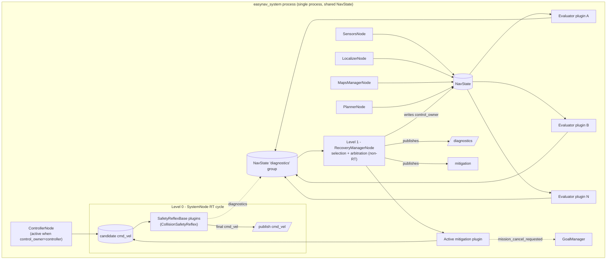

# EasyNav recovery system

## 0. Purpose and sources

This document describes EasyNav's recovery system: how the stack detects that something is
going wrong during navigation, and how it reacts to it. The design was arrived at by studying
two existing approaches to fault recovery in autonomous navigation — Nav2's **Recovery
Behaviors** and the **TOMASys/SysSelf** metacontroller proposed in Esther Aguado González's
PhD thesis, *"Systems that know what they are doing: A Model-Based Formal Specification for
Robust Autonomy"* (UPM, 2024) — and by taking the engineering mechanics from the former and the
architectural discipline (evaluation decoupled from mitigation, explicit diagnosis, escalation
up to mission level) from the latter, without adopting OWL/DL reasoning as a required piece.

Sources used:

- Nav2's code, under `src/examples/navigation2` (`nav2_behaviors`, `nav2_behavior_tree`,
  `nav2_bt_navigator`, `nav2_controller`, `nav2_planner`, `nav2_core`) and
  `https://docs.nav2.org/rolling/`.
- `ESTHER_AGUADO_GONZALEZ.pdf`, in particular Chapter 7 (the TOMASys antecedent), Chapter 8
  (SysSelf's operationalization) and Chapter 9 (evaluation cases, notably the Pioneer mobile
  robot running Nav2 and the TIAGo/TurtleBot2 scenarios).
- EasyNav's own code, under `src/EasyNavigation` (`easynav_core`, `easynav_system`,
  `easynav_controller`, `easynav_planner`, `easynav_localizer`, `easynav_sensors`,
  `easynav_maps_manager`, `easynav_interfaces`, `easynav_recovery`) and
  `src/easynav_plugins`.

---

## 1. Nav2: Recovery Behaviors

### 1.1 Plugin architecture

Nav2 splits the problem into two cooperating layers:

- **`nav2_core::Behavior`** (`nav2_core/include/nav2_core/behavior.hpp:41-83`): an abstract
  interface with `configure()/cleanup()/activate()/deactivate()/getResourceInfo()`, mirroring the
  lifecycle pattern used by planners and controllers. `getResourceInfo()` declares whether the
  plugin needs the local costmap, the global one, both, or neither, so the server only subscribes
  to what is strictly necessary.
- **`TimedBehavior<ActionT>`** (`nav2_behaviors/include/nav2_behaviors/timed_behavior.hpp:67`): a
  template implementation that wraps a `nav2::SimpleActionServer<ActionT>` and handles all the
  action mechanics (feedback, cancellation, timeouts). A concrete behavior only implements
  `onRun()` (once) and `onCycleUpdate()` (every cycle while `RUNNING`, returning
  `SUCCEEDED/FAILED/RUNNING` plus an error code).
- **`BehaviorServer`** (`nav2_behaviors/include/nav2_behaviors/behavior_server.hpp`): a single
  `LifecycleNode` that loads every behavior through `pluginlib::ClassLoader<nav2_core::Behavior>`
  (`behavior_server.cpp:79-101`) and forwards `configure/activate/deactivate` 1:1 to each plugin.
  Each plugin registers with `PLUGINLIB_EXPORT_CLASS` (e.g. `plugins/spin.cpp:184`) against the
  `behavior_plugin.xml` manifest.

### 1.2 Detection and triggering

Detection lives almost entirely in the **behavior tree (BT)**, not inside the servers:

1. **Structural error codes.** `controller_server`/`planner_server` catch internal exceptions
   (`NoValidControl`, `PatienceExceeded`, `FailedToMakeProgress`, `NoValidPath`, ...) and translate
   them into a numeric `error_code` in the action result
   (`nav2_controller/src/controller_server.cpp:543-615`).
2. **Condition nodes over those codes**: `AreErrorCodesPresent`
   (`plugins/condition/are_error_codes_present_condition.hpp:38-72`) and its specializations
   `WouldAControllerRecoveryHelp`, `WouldAPlannerRecoveryHelp`, etc., decide whether a recovery is
   worth attempting for that particular code (avoiding, for example, clearing a costmap on a
   `TF_ERROR`, which it would not fix).
3. **Conditions on state/sensors directly**, independent of actions: `IsStuckCondition` (anomalous
   deceleration on `/odom`), `IsBatteryLowCondition`, `GoalUpdatedCondition` (aborts the recovery
   if the user changes the goal), `TransformAvailableCondition`.

Structural triggering is orchestrated by the control node **`RecoveryNode`**
(`nav2_behavior_tree/.../recovery_node.cpp:31-119`): it has exactly two children — the main
subtree and the recovery subtree — and if child 0 fails, it runs child 1; if child 1 succeeds, it
retries child 0, up to `number_of_retries`.

### 1.3 Taking control

Nav2 **has no explicit `cmd_vel` arbiter**: control transfers as a side effect of ROS 2 action
cancellation semantics.

- When the BT stops ticking the in-flight `FollowPath` action (because `RecoveryNode` is about to
  run the recovery child), `BtActionNode::halt()`
  (`nav2_behavior_tree/.../bt_action_node.hpp:325-352`) cancels the active goal on the
  `controller_server`, which stops publishing to `cmd_vel`.
- Only then does the BT send the recovery goal (e.g. `Spin`); `behavior_server` starts publishing
  to `cmd_vel` from `TimedBehavior::execute()`.
- On completion, the recovery publishes a zero `Twist` (`stopRobot()`,
  `timed_behavior.hpp:298-308`) and `RecoveryNode` ticks child 0 again, which resends the
  `FollowPath` goal and regains control.

In other words, mutual exclusion is an **emergent effect** of only one action server ever having
an active goal at a time — there is no mutex or arbitration bus. `AssistedTeleop` is the
exception: it does not take exclusive control, it filters an external `cmd_vel` for safety
(supervised control, not autonomous).

### 1.4 Catalog of behaviors

| Behavior | Mechanism |
|---|---|
| **Spin** | Rotates in place to `target_yaw`, with forward collision simulation |
| **BackUp** / **DriveOnHeading** | Straight-line forward/backward motion with acceleration limits and collision checking |
| **Wait** | No actuation; simply waits for a duration |
| **AssistedTeleop** | Filters a human teleoperation `cmd_vel` with collision checking |
| **Clear\*CostmapService** (BT, not behavior_server) | Calls `nav2_msgs/srv/Clear*` services on the costmap layers |

### 1.5 Composition and scaling

The default tree (`navigate_to_pose_w_replanning_and_recovery.xml`) nests **three levels**:

1. An inner `RecoveryNode` (retries=1) around `ComputePathToPose`/`FollowPath`: cheap, local
   recovery (clearing the relevant costmap), gated by `WouldAXRecoveryHelp`.
2. If that fails, the outer `RecoveryNode` (retries=6) activates a larger recovery branch.
3. Inside it, a **`RoundRobinNode`** (`round_robin_node.cpp:35-94`) rotates through
   clear-costmaps → `Spin` → `Wait` → `BackUp` on successive retries, wrapped in a
   `ReactiveFallback` that checks `GoalUpdated` on every tick to abort if the operator redirects
   the robot.

### 1.6 Use of a "blackboard"

BT.CPP's blackboard is the minimal shared state: the ROS node handle, the TF buffer, and above
all the `number_recoveries` counter (`increment_recovery_count()`,
`bt_action_node.hpp:459-465`), exposed to the client as `feedback.number_of_recoveries` — the only
"out of the box" observability signal for how much recovery is happening.

### 1.7 Assessment

**Strengths**: a mature, production-proven plugin architecture; reusable, safe movement behaviors
(with built-in collision checking); declarative, auditable composition in XML; near-zero
computational cost (BT ticks plus direct conditions on already-available data).

**Weaknesses** (some explicitly pointed out by Esther Aguado herself in §9.3.1 of her thesis,
comparing her approach with Nav2): failure→recovery associations are **hand-coded in XML** for
each application; there is no **traceability** of why a given recovery fired (the reason lives
only in the head of the engineer who wrote the tree); and a "broad-brush" recovery can have
**side effects** — for example, clearing the global costmap because of a planner failure can
affect the local costmap used by a controller that was working fine.

---

## 2. Esther Aguado's proposal (TOMASys / SysSelf)

### 2.1 Conceptual framework: the metacontroller and the MAPE-K loop

The thesis starts from TOMASys (*Teleological and Ontological Model for Autonomous Systems*) and
evolves it into **SysSelf**. Its central idea is the **metacontroller**: while a conventional
controller closes a loop over a physical variable (e.g. velocity), the metacontroller closes a
loop **over the system's functionality**, triggering a reconfiguration when the system deviates
from what is expected.

Execution follows the **MAPE-K** pattern (Monitor–Analyze–Plan–Execute over a shared Knowledge
Base):

- **Monitor**: an *observer* detects component failures or quality-of-service (QA) metrics
  falling below what is required.
- **Analyze**: a reasoner (ontological, with SWRL rules in TOMASys; with Category Theory in
  SysSelf, to reduce reasoning cost) propagates the failure from the *Component* up to the
  *Function Grounding* and from there to the *Objective*, marking which alternative *Function
  Designs* remain achievable.
- **Plan**: the best available *Function Design* meeting the QA requirements (safety, energy,
  performance) is chosen.
- **Execute**: the reconfiguration is carried out (swapping a component, remapping topics,
  adjusting parameters, or, as a last resort, changing the mission's objective).

### 2.2 Concept model

| Concept | Meaning |
|---|---|
| **Function** / **Objective** | What the system must achieve (e.g. "navigate") |
| **Function Design** | A concrete design alternative to achieve the function (e.g. "localize with lidar" vs. "localize with an RGB-D camera") |
| **Function Grounding** | The running instance of a Function Design at a given moment |
| **Component** | An actual structural module (sensor, actuator, software node) |
| **Quality Attribute (QA)** | A metric (safety, energy, performance) estimated at design time and measured at runtime |

### 2.3 Reference ROS 2 implementation

The most directly applicable part for EasyNav is the practical implementation (Chapter 8):

- **Two ROS 2 nodes**: an *observer* node that continuously monitors components, capabilities,
  objectives and values, and publishes a **diagnostic message** when something fails or degrades
  below the expected threshold (with: affected entity, extra information, severity —
  error/warning); and a **metacontroller** node that waits for that message, reasons over the
  model, and executes the reconfiguration.
- The reconfiguration is materialized as **YAML files** describing the chosen solution (which
  node to launch, which parameters to use, which remaps to apply).
- Explicit requirements the work itself places on any system adopting this approach:
  **redundancy** (a real alternative to switch to must exist), **monitoring** (components must
  report their state in real time) and **reconfigurability** (the system must allow
  substituting/launching/parameterizing components on the fly).

### 2.4 Relevant case studies

- **UX-1 (mining underwater robot)**: a thruster fails → the metacontroller selects the
  propulsion *Function Design* that does not depend on the failed thruster.
- **TIAGo/TurtleBot2, lidar contingency (MROS)**: when the lidar fails, the metacontroller detects
  that an RGB-D camera can cover the same function (localization/obstacle detection) at a lower
  QA, and reconfigures by remapping `pointcloud_to_laserscan` to the *scan* topic consumed by the
  rest of the Nav2 stack, **also lowering the speed limit** because the new source is
  slower/noisier.
- **Pioneer mobile robot + Nav2, Scenario 4 (critical sensor failure)**: reproduces the previous
  case on real Nav2, substituting `/urg_node` (lidar) with `/pointcloud_to_laserscan` (camera)
  without stopping the mission.
- **Scenario 5 (unrecoverable capability error)**: a communication failure with the operator has
  no alternative within the system; the metacontroller **does not reconfigure a component, it
  changes the mission's objective**, sending the robot to a `safe_wp` (safe waypoint) to wait for
  maintenance. This is key: mitigation is not always "swap a part," sometimes it is "relax/change
  the mission."

### 2.5 Explicit critique of Nav2 (thesis §9.3.1)

The author herself contrasts her approach with Nav2's and points out exactly the weaknesses
described in §1.7: Nav2's failure→recovery rules are "ad hoc," the engineer's reasoning is not
represented anywhere (a lack of transparency/traceability), and a recovery can "contaminate" a
healthy subsystem (her example: clearing the global costmap because of a planner failure can
affect the local costmap of a controller that was working fine).

### 2.6 Assessment

**Strengths**: an explicit, disciplined separation between *detecting* (Monitor+Analyze) and
*acting* (Plan+Execute); explicit traceability and justification for each decision; generality
(the same metacontrol engine serves a submarine or an indoor robot); the ability to scale
mitigation **beyond the component**, up to mission level (changing the objective, not just the
actuator).

**Weaknesses / cost**: it requires explicitly modeling the system in an OWL ontology
(non-trivial engineering effort, a steep learning curve — a limitation the thesis itself
acknowledges in its conclusions); TOMASys's DL/SWRL reasoning turned out to be
**computationally expensive** (growing exponentially with the knowledge base's size, ~700 ms for
a 26-individual model ≈ 1.4 Hz), which motivated the move to Category Theory in SysSelf; even
with that improvement, measured recovery times are **~1-5 s** (versus the few milliseconds of a
BT tick); it depends on an external reasoning engine (Pellet/Owlready2) outside the usual ROS 2
ecosystem.

---

## 3. Comparison

| Dimension | Nav2 | TOMASys / SysSelf |
|---|---|---|
| Where detection lives | Behavior tree (conditions + error codes) | Observer node + reasoner over a model |
| How mitigation is decided | Hand-coded in XML (fixed round-robin) | Dynamically selected by reasoning over QAs/realizability |
| Taking control | Side effect of cancelling/launching actions | Explicit reconfiguration (launch/stop nodes, remap) |
| Scope of mitigation | Robot motion / clearing maps | Component, capability, **or the mission itself** |
| Traceability | None explicit (reason only in the designer's head) | Explicit (queryable model) |
| Computational cost | Practically none | Significant (hundreds of ms to seconds) |
| Authoring effort | Edit XML + write a C++ plugin | Model an OWL ontology + observers |
| Extensibility | High (pluginlib + new conditions) | High in theory, expensive in practice (formal model) |

**Takeaway**: Nav2 gets the *engineering mechanics* right (lightweight plugins, lifecycle, a
reusable behavior catalog, near-zero cost) but falls short on the *decision architecture*
(everything hard-coded, no traceability, scope limited to motion/maps). SysSelf gets the
*decision architecture* right (evaluation/mitigation separation, traceability, mission-level
scope) but pays an engineering and runtime cost that does not fit a 200 Hz control loop like
EasyNav's.

EasyNav's recovery system takes Nav2's mechanics (plugins, lifecycle, a catalog of behaviors) and
SysSelf's architectural discipline (evaluation decoupled from mitigation, explicit diagnosis,
escalation up to mission level), **without** adopting OWL/DL reasoning as a required piece.

---

## 4. Foundations reused from EasyNav's existing architecture

The recovery system does not introduce a parallel coordination mechanism: it builds directly on
pieces EasyNav already had.

- **`NavState`** (`easynav_common/include/easynav_common/types/NavState.hpp`) is the real
  *blackboard*: a type-safe key→value map, protected by a `std::mutex`, shared via `shared_ptr`
  between `SystemNode` and all of its subsystems. Its **group** mechanism
  (`set_group()`/`get_group()`/`get_group_keys()`), already used by `SensorsNode` to aggregate
  perceptions from several sensors, is reused as-is to aggregate diagnostics from several
  evaluators under the `"diagnostics"` group.
- **`SystemNode`** (`easynav_system/include/easynav_system/SystemNode.hpp`) is a `LifecycleNode`
  that owns `SensorsNode`, `LocalizerNode`, `MapsManagerNode`, `PlannerNode`, `ControllerNode` and
  now `RecoveryManagerNode`, all also `LifecycleNode`s, orchestrated in two manual loops
  (`SystemNode::system_cycle_rt()` and `SystemNode::system_cycle()`): an RT loop at `rt_freq`
  (`sensors→localizer→controller/recovery→safety reflexes→publish cmd_vel`) and a non-RT loop at
  `freq` (`sensors→localizer→maps_manager→goal_manager→planner→recovery evaluation`). This matches
  the project's own long-standing requirement that the system be *"well synchronized, with
  real-time and non-real-time parts, all in one process"* — recovery evaluation lives in this same
  process, not in a separate node.
- **`MethodBase`** (`easynav_core/include/easynav_core/MethodBase.hpp`) already gives every
  plugin frequency control (`isTime2Run(RT)`, `setRun(RT)`) and already warns when a plugin
  overruns its cycle budget (`RCLCPP_WARN_THROTTLE`) — every `MethodBase`-derived interface,
  `SafetyReflexBase`/`RecoveryEvaluatorBase`/`RecoveryMitigationBase` included, inherits it.
- **`ControllerMethodBase`**'s old `is_inminent_collision()/on_inminent_collision()` mechanism —
  historically the only real `cmd_vel` override in EasyNav — was the direct architectural
  precedent for `SafetyReflexBase` (§5.1). It has since been fully replaced by
  `CollisionSafetyReflex` (§5.2): `ControllerMethodBase` no longer performs its own collision
  check, and every `MethodBase`-derived interface (`ControllerMethodBase`, `PlannerMethodBase`,
  `LocalizerMethodBase`, `MapsManagerBase`) now catches exceptions thrown by a plugin's
  update/cycle methods at the invocation point, logging and continuing instead of letting a
  misbehaving plugin crash the process.
- **`PlannerMethodBase::force_update()`** and **`GoalManagerClient`** remain available to
  mitigation plugins that would need them, though the mitigations actually shipped today act
  through `cmd_vel`, `NavState` signals or mission cancellation rather than forcing a replan or
  sending an alternate goal (see §5.8, §5.11).
- **`GoalManager::set_error()`/`set_failed()`**, previously only exercised by tests, is now
  called from a real path: `GoalManager::update()` reads the one-shot `"mission_cancel_requested"`
  key written by `CancelMissionRecovery` and calls `set_error()` (see §5.8).
- **Plugin convention**: pluginlib + `PLUGINLIB_EXPORT_CLASS`, one `<package>_plugins.xml`
  manifest per package, selection via `<type>_types` + `<instance>.plugin` parameters, all against
  base interfaces declared in `easynav_core`. The recovery system's three new interfaces
  (`SafetyReflexBase`, `RecoveryEvaluatorBase`, `RecoveryMitigationBase`) follow this same pattern
  exactly.

---

## 5. The recovery system

### 5.1 Guiding principles

1. **Evaluation runs in-process.** Diagnosing failures needs to read `NavState` at minimal cost
   and without IPC latency, so it runs in the same process as `SystemNode`, like every other
   subsystem.
2. **Evaluation and mitigation are distinct, decoupled responsibilities**: an evaluator never acts
   on the robot; a mitigator never decides *when* it should run beyond declaring which diagnostics
   it can handle.
3. **Urgency outranks elegance.** Not every failure can wait for deliberative reasoning: what
   demands a same-cycle reaction (an imminent collision at speed) is resolved by a synchronous
   real-time reflex, not by the same mechanism that decides, say, to change the mission's
   objective.
4. **Everything is a plugin**, following the pattern already used by controller/planner/localizer:
   new detection, reflex or mitigation strategies are added without touching the core, via
   pluginlib.
5. **Authoring affinity.** Whoever knows a component's failure modes best is whoever wrote it: a
   specialized recovery evaluator/mitigator can live in the same package as the component it
   diagnoses, instead of being forced into a generic, disconnected package (§5.9).
6. **Reuse what EasyNav already has** (`NavState` groups, `MethodBase`, `force_update()`,
   `GoalManagerClient`, the `on_inminent_collision` precedent) instead of inventing a parallel
   coordination protocol (§4).

### 5.2 Two levels: safety reflexes (RT) and deliberative recovery (non-RT)

Not everything called "recovery" tolerates the latency of a non-RT cycle. The paradigmatic case
is collision avoidance: at high speed, delaying that reaction until the next `RecoveryManagerNode`
cycle would be unacceptable. The system is therefore split into two levels:

| | **Level 0 — Safety reflexes** | **Level 1 — Deliberative recovery** |
|---|---|---|
| Frequency | RT cycle (same rate as `cmd_vel`) | non-RT cycle |
| Logic | Synchronous, cheap, no reasoning | Diagnosis + selection + arbitration (lightweight MAPE-K) |
| Lives in | `SystemNode`, at the single point where `cmd_vel` is published | `RecoveryManagerNode` |
| Interface | `SafetyReflexBase` | `RecoveryEvaluatorBase` / `RecoveryMitigationBase` |
| Example | Imminent collision → override `cmd_vel` | Repeated proximity stop → back away |
| Can veto/override `cmd_vel` | Yes, always, regardless of who produced it | Not directly; acts through `control_owner` (§5.7) |

**Why the reflex lives in `SystemNode`, not in `ControllerNode`.** With the control-arbitration
design of §5.7, the `cmd_vel` published each cycle can come from the nominal controller **or**
from an active movement mitigation (e.g. `SafeRetreatRecovery`). If the collision check were tied
only to the controller, it would stop applying exactly when a recovery has control — the worst
moment to lose that protection. `SystemNode` therefore loads `SafetyReflexBase` plugins (via
`safety_reflex_types`, a `pluginlib::ClassLoader<SafetyReflexBase>` analogous to the ones already
used by `ControllerNode`/`PlannerNode`) and runs them in `system_cycle_rt()`, right before the
point where `cmd_vel` is published, regardless of who wrote it that cycle
(`SystemNode.cpp::system_cycle_rt()`). The only reflex shipped today, **`CollisionSafetyReflex`**
(`easynav_controller/include/easynav_controller/CollisionSafetyReflex.hpp`), replaces — not
supplements — the old collision check that used to live inside `ControllerMethodBase`: it
forward-projects the commanded `cmd_vel` against nearby point-cloud perceptions and, if continuing
would cause a collision within the current braking distance, overwrites `cmd_vel` with a
controlled brake. The three controllers that used to read the old, shared collision parameters
(`RegulatedPurePursuitController`, `MPCController`, `VffController`) were decoupled to declare
their own parameters instead of relying on that removed mechanism.

A reflex's own failure is treated as unsafe rather than benign: `SafetyReflexBase` catches any
exception thrown by `check()`/`mitigate()`, stops the robot as a fail-safe default, and reports an
`ERROR` diagnostic instead of assuming the reflex is simply inactive. When triggered, a reflex
also writes an entry to the shared `"diagnostics"` group of `NavState` (key
`"diagnostics.<plugin_name>"`, `hardware_id = "safety_reflex"`, level `OK`/`WARN`/`ERROR`),
written only when the level actually changes so the RT path stays cheap. This lets level-1
evaluators notice a reflex triggering repeatedly and factor that into their own diagnosis, without
the RT reaction itself ever depending on the slower cycle.

**The transition from level 0 to level 1 is a condition on the data, not a cross-thread
synchronization mechanism.** The RT and non-RT cycles run in parallel, in different threads, so an
evaluator could read `NavState` mid-braking. `ObstacleTooCloseEvaluator`
(`easynav_plugins/recovery_evaluators/easynav_obstacle_too_close_evaluator`) illustrates the
pattern actually implemented: it only raises an `ERROR` diagnostic once (1) the robot's measured
velocity (`robot_pose.twist`) has stayed below a small epsilon for a configurable debounce window
(`debounce_duration`, confirming the robot has actually stopped, not just that it is decelerating)
and (2) the nearest-obstacle distance, computed by the shared `compute_nearest_obstacle()` helper
(`easynav_core/include/easynav_core/ObstacleProximity.hpp`), is still below `safe_distance`. While
the robot is still moving, it reports `OK` with an informative message and no mitigator is
selected for it.

### 5.3 Where each piece lives

| Element | Package | Follows the precedent of |
|---|---|---|
| `SafetyReflexBase`, `RecoveryEvaluatorBase`, `RecoveryMitigationBase` (interfaces) | `easynav_core` | `ControllerMethodBase`, `PlannerMethodBase`, etc. |
| `RecoveryManagerNode` (node, plugin loading, arbitration) | `easynav_recovery` (`src/EasyNavigation`) | `easynav_controller`, `easynav_planner`, ... |
| `CollisionSafetyReflex` (reference reflex) | `easynav_controller` | Its previous home inside `ControllerMethodBase` |
| `NoPathEvaluator`, `ControllerStuckEvaluator`, `ObstacleTooCloseEvaluator` (generic evaluators) | `src/easynav_plugins/recovery_evaluators/...` | `easynav_simple_controller`, `easynav_vff_controller`, ... |
| `SafeRetreatRecovery`, `AdvanceRecovery`, `HumanAssistanceRecovery`, `CancelMissionRecovery` (generic mitigations) | `src/easynav_plugins/recovery_mitigations/...` | ídem |
| `AmclConvergenceEvaluator` / `AmclRelocalizeMitigation` (component-specialized recovery) | `easynav_costmap_localizer`, alongside `AMCLLocalizer` | New pattern — see §5.9 |

Each plugin registers against `base_class_type="easynav::<Name>Base"` from `easynav_core`, using
the same `PLUGINLIB_EXPORT_CLASS`/manifest convention as any other EasyNav plugin category.

### 5.4 `easynav_recovery`: `RecoveryManagerNode`

`RecoveryManagerNode` is a `LifecycleNode` (deployed under the name `"recovery_node"`, distinct
from `"system_node"`) owned and lifecycle-managed by `SystemNode` exactly like the other
subsystems. Its non-RT work (evaluation and mitigation selection) runs from
`SystemNode::system_cycle()`; the RT part of an active, control-owning mitigation runs from
`SystemNode::system_cycle_rt()`. The name deliberately avoids `RecoveryNode`, to not collide
conceptually with BT.CPP's control node of that name in Nav2, which is a different thing.

Unlike `ControllerNode`/`PlannerNode` (which host exactly one active plugin instance),
`RecoveryManagerNode` loads and runs **every** configured `RecoveryEvaluatorBase` plugin
(`evaluator_types` parameter) every cycle — recovery evaluation is composed from several
independent, narrowly-scoped diagnoses — and loads a set of `RecoveryMitigationBase` candidates
(`mitigation_types` parameter), of which **at most one is active at a time**.



### 5.5 Evaluation: `RecoveryEvaluatorBase`

```cpp
// easynav_core/include/easynav_core/RecoveryEvaluatorBase.hpp
class RecoveryEvaluatorBase : public MethodBase
{
public:
  void internal_update(NavState & nav_state);  // exception-safe wrapper called by RecoveryManagerNode

protected:
  virtual void update(NavState & nav_state) = 0;  // reads NavState only, never writes cmd_vel/etc.
  void publish_diagnostic(
    NavState & nav_state, const diagnostic_msgs::msg::DiagnosticStatus & status);
};
```

An evaluator only reads `NavState`; deciding and acting on a diagnosis is
`RecoveryMitigationBase`'s and `RecoveryManagerNode`'s job. Every call to `update()` is expected
to call `publish_diagnostic()` with the evaluator's *current* assessment, including a benign one
(`DiagnosticStatus::OK`) once whatever it was reporting has been resolved — `publish_diagnostic()`
overwrites the plugin's previous entry under `"diagnostics.<plugin_name>"` rather than
accumulating history, so a resolved condition does not linger in the shared `"diagnostics"` group.

The three generic evaluators shipped today:

| Evaluator | What it detects | `hardware_id` |
|---|---|---|
| `NoPathEvaluator` | `WARN` if the planner has not produced a `"path"` yet; `ERROR` if it produced an empty one; `OK` (silently) when there is no active goal | `"planner"` |
| `ObstacleTooCloseEvaluator` | `ERROR` once the robot has been measurably stopped for a debounce window **and** the nearest obstacle is still closer than `safe_distance` (see §5.2) | `"obstacle_proximity"` |
| `ControllerStuckEvaluator` | `ERROR` when `cmd_vel` commands motion above `linear_velocity_threshold` but the robot's position has not moved by `progress_distance_threshold` for `stuck_time_threshold` seconds | `"controller_stuck"` |

`ControllerStuckEvaluator` explicitly silences itself to `OK` (without diagnosing anything) in
four situations, to avoid diagnosing its own system's normal behavior as a new failure:
navigation is paused (`"navigation_paused"`), `control_owner` is not `"controller"` (a mitigation
already has control), a `SafetyReflexBase` is currently intervening (`hardware_id ==
"safety_reflex"` with a non-`OK` level), or there is no active goal.

### 5.6 Selection and arbitration: `RecoveryManagerNode`

Every non-RT cycle, `RecoveryManagerNode::cycle()`:

1. Runs `internal_update()` on every loaded evaluator.
2. If a mitigation is already active, lets it continue (cycling it here only if it does **not**
   `requires_control()` — control-owning ones are cycled from `cycle_rt()` instead) and returns,
   without attempting a new selection this same cycle.
3. Otherwise, scans the `"diagnostics"` group for the first non-`OK` entry and picks the first
   loaded mitigation, in priority order, whose `can_handle(status)` accepts it and that is not
   already excluded for that specific diagnostic key.

Priority is a plain per-instance parameter (`"<mitigation_type>.priority"`, lower value tried
first, default 100, ties broken by `mitigation_types` list order) read by `RecoveryManagerNode` —
not a virtual `score()` method on the mitigation itself, which keeps a mitigation plugin fully
unaware of how arbitration works. A mitigation that returns `RecoveryStatus::FAILED` is recorded
in `excluded_mitigations_`, keyed by the diagnostic key that selected it, so the next cycle tries
the next applicable candidate instead of reselecting the one that just failed; the exclusion is
forgotten as soon as that diagnostic is observed `OK` again, so a future recurrence restarts the
escalation from the first candidate. There is no time-based cooldown and no retry counter, and
arbitration never reasons across different diagnostic codes at once — each diagnostic key is
arbitrated independently.

```cpp
// easynav_core/include/easynav_core/RecoveryMitigationBase.hpp
enum class RecoveryStatus { RUNNING, SUCCEEDED, FAILED };

class RecoveryMitigationBase : public MethodBase
{
public:
  virtual bool can_handle(const diagnostic_msgs::msg::DiagnosticStatus & status) const = 0;
  virtual bool requires_control() const {return false;}

  void internal_start(NavState & nav_state);
  RecoveryStatus internal_cycle(NavState & nav_state);  // exception-safe: an exception is treated as FAILED
  void internal_stop(NavState & nav_state);

protected:
  virtual void on_start(NavState & nav_state) {}
  virtual RecoveryStatus on_cycle(NavState & nav_state) = 0;
  virtual void on_stop(NavState & nav_state) {}
  void stop_robot(NavState & nav_state);
  void report(NavState & nav_state, uint8_t level, const std::string & msg);
};
```

### 5.7 How a recovery mitigation takes control

1. `NavState` carries a `"control_owner"` string key, written only by `RecoveryManagerNode`.
   Default/absent value: `"controller"`.
2. When `RecoveryManagerNode` selects a mitigation with `requires_control() == true`, it calls
   `on_start()` and sets `nav_state.set("control_owner", "recovery:<name>")`.
3. In `SystemNode::system_cycle_rt()`: if `control_owner == "controller"`, the RT cycle calls
   `controller_node_->cycle_rt(...)` as usual; otherwise it calls `recovery_node_->cycle_rt(...)`,
   which runs the active mitigation's `internal_cycle()` and writes its result to the same
   `"cmd_vel"` key `SystemNode` already publishes at the end of the cycle — the publication point
   is not duplicated, only who writes that key changes. Either way, the resulting `cmd_vel` still
   passes through every loaded `SafetyReflexBase` before publication (§5.2).
4. When `on_cycle()` returns `SUCCEEDED` or `FAILED`, `RecoveryManagerNode` calls `on_stop()` and
   restores `control_owner = "controller"`; the nominal controller regains control the next RT
   cycle.
5. Mitigations that do not `requires_control()` (e.g. `CancelMissionRecovery`) never touch
   `control_owner`: they act purely by writing a `NavState` signal that some other subsystem reads
   and consumes (§5.8), and are cycled from `RecoveryManagerNode::cycle()` at non-RT rate.

A mitigation never holds a direct reference to another subsystem (`PlannerNode`, `GoalManager`,
`MapsManagerNode`): every piece of coordination between a recovery plugin and the rest of the
system goes through a `NavState` key that the owning subsystem reads and resets, mirroring how
`control_owner` itself works. This is what lets recovery plugins be written, compiled and tested
without knowing about `GoalManager` or any other concrete subsystem.

### 5.8 Mission-level escalation

The final rung of the escalation ladder is **`CancelMissionRecovery`**
(`easynav_plugins/recovery_mitigations/easynav_cancel_mission_recovery`): a mitigation that
accepts any `ERROR` diagnostic no other mitigation resolved, does not move the robot
(`requires_control() == false`), and has no reference to `GoalManager`. `on_start()` writes a
one-shot `"mission_cancel_requested"` key in `NavState`; `GoalManager::update()` reads it, calls
`GoalManager::set_error(reason)` — connecting a call path that used to be exercised only by
tests — and resets the signal. `on_cycle()` reports `FAILED`, not `SUCCEEDED`, once the signal is
consumed: cancelling the mission does not resolve the diagnostic that triggered it (e.g. an AMCL
divergence stays a divergence), and reporting success would make it immediately eligible for
reselection.

### 5.9 Component-specialized recovery, co-located with its component

Beyond the generic catalog, an evaluator or mitigator that depends on knowledge internal to one
specific component lives in that component's own package instead of the generic
`recovery_evaluators`/`recovery_mitigations` catalog — no new mechanism is needed for this: a
pluginlib manifest already accepts several `<class>` entries of different `base_class_type` in the
same file, so the component's existing `<package>_plugins.xml` simply grows two more entries.

The pattern is implemented today in `easynav_costmap_localizer`, alongside `AMCLLocalizer`:

- **`AmclConvergenceEvaluator`** reads the fixed key `"localizer.amcl.covariance_trace"`
  (written by `AMCLLocalizer` itself, from both its RT and non-RT cycles) and, once the trace of
  the pose covariance rises above `covariance_threshold`, publishes an `ERROR` diagnostic with
  `hardware_id = "localizer.amcl"` — a signal only the localizer's own author could reasonably
  compute.
- **`AmclRelocalizeMitigation`** matches that same `hardware_id`, takes control
  (`requires_control() == true`) and rotates the robot in place at `rotation_speed` while
  re-checking the same covariance trace, until it drops back under threshold or `timeout` elapses
  (in which case it gives up with `FAILED`).

`RecoveryManagerNode` needs no knowledge of AMCL at all: it only sees one more loaded mitigation
declaring `can_handle()` for a particular `hardware_id`, arbitrated with the same priority and
exclusion rules as any generic mitigator (§5.6). This keeps the recovery core fully
domain-agnostic while allowing arbitrarily deep, component-specific knowledge at the edges.

### 5.10 Observability

- **`/diagnostics`** (`diagnostic_msgs/msg/DiagnosticArray`) is published by
  `RecoveryManagerNode` from the `"diagnostics"` group of `NavState`, so standard tooling
  (`rqt_robot_monitor`, `diagnostic_aggregator`) can consume it directly, alongside EasyNav's own
  TUI.
- **The `"mitigation"` topic** (`rcl_interfaces/msg/Log` — the same message type `/rosout`
  already uses, reused rather than defining a new one) carries a narrative of what the active
  mitigation is doing. `RecoveryMitigationBase::report()` is the single call site a mitigation
  uses to write both to rosout and to this topic at once; `NavState` holds only the single latest
  report (tagged with a global sequence number), not a queue, so a mitigation that would otherwise
  report every cycle must throttle itself. `RecoveryManagerNode` also publishes a one-shot
  "resolved" sentinel on this topic once a diagnostic that had an active mitigation clears back to
  `OK`.
- The EasyNav **TUI** (`easynav_tools/easynav_tools/tui`) shows a "Diagnostics" panel fed by
  `/diagnostics` and a "Mitigation" panel (a scrolling log) fed by the `"mitigation"` topic,
  cleared on the "resolved" sentinel.

### 5.11 Catalog of shipped reflexes and mitigations

| Plugin | Level | Action | `can_handle` / trigger |
|---|---|---|---|
| `CollisionSafetyReflex` | 0 — RT reflex | Overrides `cmd_vel` on imminent collision, regardless of who produced it | Forward projection of `cmd_vel` against nearby point-cloud perceptions |
| `SafeRetreatRecovery` | 1 — Movement (`requires_control`) | Reverses in a straight line, at `retreat_speed`, until the nearest obstacle is farther than `safe_distance` | `hardware_id == "obstacle_proximity"` |
| `AdvanceRecovery` | 1 — Movement (`requires_control`) | Advances `advance_distance` at `advance_speed`; never reports the underlying problem solved, only that one activation is done; gives up (`FAILED`) once the *total* time spent across a recurring episode exceeds `escalate_after` | `hardware_id == "controller_stuck"` |
| `HumanAssistanceRecovery` | 1 — Movement (`requires_control`) | Generic catch-all: stops and waits for a human to resolve the underlying condition (the "ack" is physical — the diagnostic returning to `OK`); optional `timeout` before giving up | Any `ERROR` diagnostic — meant to be configured with low priority so more specific mitigations are tried first |
| `CancelMissionRecovery` | 1 — Mission (does not take control) | Cancels the active mission via `GoalManager::set_error()`; always returns `FAILED`, never `SUCCEEDED` | Any `ERROR` diagnostic — the last rung of the ladder |
| `AmclRelocalizeMitigation` | 1 — Movement, component-specialized (`requires_control`) | Rotates in place at `rotation_speed` until the AMCL covariance trace drops back under threshold, or `timeout` | `hardware_id == "localizer.amcl"` |

### 5.12 Worked example: a person crosses at speed

**Starting situation.** The robot moves fast along a `path`. `control_owner = "controller"`. A
person suddenly steps into the robot's way, close by.

1. **[Level 0, RT, same 200 Hz cycle]** `sensors_node_->cycle_rt()` adds the new obstacle to
   `NavState`; `controller_node_->cycle_rt()` computes a forward-moving candidate `cmd_vel` (the
   nominal controller only follows the `path`, it does not react to this). Before publishing,
   `SystemNode` runs the candidate through `CollisionSafetyReflex`, which projects the resulting
   trajectory against the freshly updated perception and detects an imminent collision;
   `mitigate()` replaces the candidate with a controlled brake, cycle by cycle, until the robot
   stops — without ever going through `RecoveryManagerNode`. Along the way it writes a `WARN`
   entry to the `"diagnostics"` group.
2. **[Level 1, non-RT]** On its own cycle, `RecoveryManagerNode` runs its evaluators.
   `ObstacleTooCloseEvaluator` could be reading `NavState` mid-brake, since the RT and non-RT
   cycles run in parallel — this is exactly why it requires the compound condition of §5.2: only
   once the robot is measurably stopped for the debounce window **and** the obstacle distance is
   still below `safe_distance` does it raise the `ERROR` diagnostic. While still braking, it
   reports an informative `OK`/`WARN` with no mitigator attached.
3. **[Level 1, non-RT]** `RecoveryManagerNode` sees the new diagnostic, no mitigation is active,
   and `SafeRetreatRecovery` is the highest-priority mitigation whose `can_handle()` accepts
   `hardware_id == "obstacle_proximity"`. It calls `on_start()`, which sets `control_owner =
   "recovery:retreat"`.
4. **[Level 0, RT, every cycle while `control_owner != "controller"`]** `SystemNode` routes the RT
   cycle to `recovery_node_->cycle_rt()`, which calls `SafeRetreatRecovery::on_cycle()`; it
   commands a slow backward `cmd_vel`. That candidate passes through the same
   `CollisionSafetyReflex` gate as the nominal controller's output — if another obstacle appeared
   behind the robot while retreating, the reflex would intervene again. Meanwhile,
   `ControllerStuckEvaluator` checks `control_owner` before evaluating (§5.6), so the lack of
   progress toward the goal during the retreat is not mistaken for a new failure.
5. **[Level 1 decides, level 0 executes]** Once the obstacle distance exceeds `safe_distance`,
   `on_cycle()` returns `SUCCEEDED`. `RecoveryManagerNode` calls `on_stop()` and restores
   `control_owner = "controller"`. The nominal controller regains control on the next RT cycle and
   resumes the `path`, which `PlannerNode` kept maintaining in the background throughout.

In this example the recovery resolves entirely at the movement level: neither the planner nor the
mission needed to be touched, and mission-level escalation (§5.8) never activates.

### 5.13 Human-assisted recovery

`HumanAssistanceRecovery` covers situations no autonomous strategy is well suited for: it stops
the robot and waits for a person to resolve whatever is wrong, rather than attempting to solve it
itself. It is deliberately simple:

- It is generic and domain-agnostic: `can_handle()` accepts any `ERROR` diagnostic, so it is
  normally configured with a low priority (or listed last in `mitigation_types`), reached only
  once every more specific mitigation has been tried and excluded.
- The "acknowledgement" that the situation was resolved is **physical**, not a protocol message:
  once every diagnostic is observed back at `OK` — presumably because a person fixed whatever was
  wrong — it returns control and the robot resumes its mission. There is no `teleop` mode and no
  episode-id/`ack` handshake.
- An optional `timeout` (seconds, default `0.0` = wait forever) bounds how long it waits before
  giving up (`FAILED`), letting a lower-priority mitigation (typically `CancelMissionRecovery`)
  take over.
- While waiting, `CollisionSafetyReflex` keeps running exactly as for any other producer of
  `cmd_vel` — the safety net does not depend on which mitigation currently holds `control_owner`.

### 5.14 Known limitations

- **Thresholds and speeds are starting points, not calibrated values**: `safe_distance`,
  `covariance_threshold`, `stuck_time_threshold`, `advance_speed`, `rotation_speed` and similar
  parameters across the plugins listed in §5.11 are reasonable defaults, not values measured on a
  real robot.
- **No time-based cooldown or cross-diagnostic reasoning**: arbitration (§5.6) is priority plus
  binary exclusion per diagnostic key; it does not track how often a diagnostic has recurred over
  time, nor does it reason about several diagnostics together.
- **No costmap/map-health or notify-and-hold mitigations**: an earlier iteration implemented
  map-clearing, forced-replan, safe-waypoint and notify-and-hold mitigations communicating through
  one-shot `NavState` signals; none had a real use case in this project (continuous replanning was
  already active, the costmap keeps no persistent obstacle memory, and there was no safe-waypoint
  or separate operator-notification use case beyond what `HumanAssistanceRecovery` already covers),
  so they were removed rather than kept unused.
- **No live-parameter self-tuning**: detecting a recurring pattern of the same mitigation firing
  repeatedly and adjusting a bounded, component-declared parameter in response (e.g. lowering a
  speed limit) was considered but not built — it was judged more ambitious than the project
  currently needs.
- **A caught plugin exception is only logged, not diagnosed**: every `MethodBase`-derived
  interface catches exceptions thrown by a plugin's update/cycle hook at the invocation point
  (§4), but only logs them (`RCLCPP_ERROR_THROTTLE`) — it does not turn them into a
  `"diagnostics"` entry a level-1 evaluator could react to. `NavState::get()`/`get_safe()` also
  still throw on a missing key or type mismatch, uncaught, everywhere outside those wrapped
  invocation points.
- **The level-0 reflex diagnostic is generic**: `CollisionSafetyReflex`'s entry in the
  `"diagnostics"` group does not carry the same level of structured detail (e.g. exact obstacle
  distance/bearing) that the level-1 evaluators do.
- **`easynav_tools plugins` does not list recovery plugins**: the CLI's plugin-listing verb still
  only covers the "regular" navigation categories (controller, planner, localizer, ...), not
  `SafetyReflexBase`/`RecoveryEvaluatorBase`/`RecoveryMitigationBase`.

### 5.15 Example deployment

A representative configuration (from a downstream robot's parameter file, shown here only to
illustrate how the pieces above are wired together):

```yaml
system_node:
  ros__parameters:
    safety_reflex_types: [collision]
    collision:
      plugin: easynav_controller/CollisionSafetyReflex

recovery_node:
  ros__parameters:
    evaluator_types: [no_path, obstacle_close, amcl_convergence, controller_stuck]
    mitigation_types: [retreat, amcl_relocalize, advance, human_assistance, cancel_mission]
    # priorities: retreat / advance / amcl_relocalize = 10; human_assistance = 1000; cancel_mission = 2000
```

With this configuration, a lost localization escalates as: `amcl_relocalize` (rotates for up to
5 s) → excluded on failure → `human_assistance` (stops and waits up to 10 s) → excluded on
timeout → `cancel_mission` (cancels the mission, reporting which diagnostics were still in
`ERROR`). In parallel, `retreat` and `advance` independently handle their own diagnostics
(proximity and stuck-controller) without interfering with that escalation.

---

## 6. Conclusion

Nav2 supplies the "how" at the engineering level: a lightweight plugin pattern, with lifecycle,
cheap at runtime, and a catalog of movement behaviors already validated in production. Esther
Aguado's thesis supplies the "what" at the decision-architecture level: separating evaluation from
mitigation explicitly, making the failure→remedy relationship traceable, and recognizing that
mitigation can reach all the way to mission level, not just the actuator.

EasyNav's recovery system takes both pieces without inheriting their respective costs: evaluation
runs inside EasyNav's own process (as reading `NavState` at minimal cost requires); both
evaluators and mitigators are interchangeable pluginlib plugins (extensible without touching the
core); taking control generalizes the pre-existing `on_inminent_collision` precedent into an
explicit arbitration key (`control_owner`) instead of depending on action cancellations; and the
default decision engine is a cheap, per-instance priority parameter plus binary exclusion, with no
OWL/DL reasoning anywhere in the loop.

Two design choices complete the picture and address concrete limitations of both references.
First, a synchronous **level-0 safety-reflex layer**, running on the real-time cycle itself, is
kept fully separate from the **level-1 deliberative layer** — so a critical reaction (avoiding a
collision at speed) never depends on the latency of any reasoning, however light, and protects the
robot regardless of which mitigator currently holds control. Second, the recovery catalog is not
limited to a closed set of generic plugins: perception, localization, planning and control plugins
are encouraged to ship, in their own package, evaluators and mitigators specialized in their own
failure modes — the same principle TOMASys/SysSelf argues for (whoever designs a component is
best placed to diagnose and repair it), achieved here without any formal ontology, using only the
plugin mechanism EasyNav already had. `AmclConvergenceEvaluator`/`AmclRelocalizeMitigation` (§5.9)
is a working instance of exactly that pattern, not a hypothetical one.

Compared with the original design, a handful of deliberate simplifications were made along the
way — a flat priority-plus-exclusion arbiter instead of a full per-diagnostic-code priority table
with cooldowns, a straight-back-only retreat instead of a side-stepping one, no `teleop` mode or
episode-id handshake for human assistance, and the map/planner/mission mitigation catalog trimmed
down to the one (`CancelMissionRecovery`) that had an actual use case in this project. None of
these change the underlying architecture; they are the kind of adjustment that only becomes
visible once a design is actually built.
